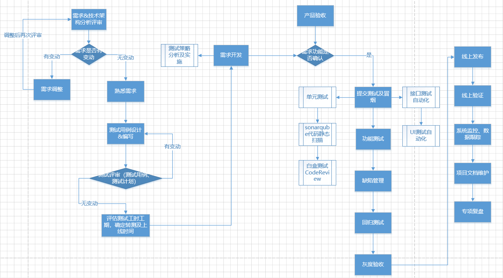

## 测试常见问题与流程篇
### 1、自我介绍
答：满足面试官对信息的期待；**产生好感**；**记住你。**
#### 1.1、面试官想听什么？
1. 面试官想听简历里不一样的
2. 时间不要太久，最好控制在3分钟之内
3. 做过哪些项目，做的项目是否符合招聘需求
4. 有最熟悉的技术点，是否拥有学习能力
#### 1.2、建议说法
**万能公式**：
==**姓名 + 毕业院校 + 实习过的公司 + 做过的项目/学习过的项目 + 用到的技术 + 爱好 + 职业计划 + 工作中最能体现能力的一段项目经历，稍加修饰，拿职业能力发展串起来 + 一两句体现能力的亮点**==
#### 1.3、总结
示例：面试官您好，我是毕业于 XX 大学的 XX（姓名），我曾经在 XX 公司的 XX项目中担任测试实习生。 之前测试XX项目时需要使用 web 自动化（根据实际情况），所以，我使用了 python + selenium + po 的设计模式，完成了 XX 功能并得到组内一致好评。那接下来我希望能够在自动化测试方面深耕，希望在今年能够做到根据业务需求完成测试框架的二次开发。我发现现在 APP 测试应用比较广泛，也有很多技术点值得去挖掘。闲暇时间也想多去学习学习 APP 自动化并应用在公司项目中。
### 2、测试的目的是什么？
答：**发现软件缺陷、提升软件质量、避免发布后存在风险**。
### 3、测试流程大概是什么？
答1：**需求评审——>测试方案及计划——>编写测试用例——>测试用例评审——>冒烟测试——>测试执行——>缺陷跟踪——>关注风险、进度及时反馈——>完成测试，测试报告——>发布上线——>线上监控日志、数据监控——>项目文档维护——>项目复盘**
答2：
1. 阅读相关文档（如产品PRD、UI设计、产品流程图等）。
2. 参加需求评审会议。
3. 编写测试计划。（根据最终确定的需求文档）
4. 编写测试用例（等价类划分法、边界值分析法等）。
5. 用例评审，给出冒烟用例（主要参与人员：开发、测试、产品、测试leader）
6. 开发冒烟测试，并发提测邮件
7. 执行测试用例，记录bug
8. 验证bug与回归测试。
9. 写测试报告，给产品发验收邮件，并配合验收
10. 版本上线
11. 线上日志分析，跟踪

### 4、测试用例评审会议主要做什么？
作为质量测试人员，测试用例评审会议是一个非常重要的环节，主要关注以下三个方面：
1. **测试用例的完整性和准确性**：质量测试人员需要对测试用例进行全面地检查，确保测试用例能够覆盖所有的功能和场景，同时要验证测试用例的正确性和可行性，保证测试用例的准确性。如果发现测试用例有缺陷或不合理的地方，需要及时提出修改意见。
2. **测试计划和测试策略**：质量测试人员需要根据测试用例评审结果，对测试计划和测试策略进行调整和确认，以确保测试能够全面地覆盖业务需求和用户期望，同时保证测试的效率和准确性。
3. **测试用例优先级**：质量测试人员需要根据测试策略和测试目标，确定测试用例的优先级，并根据优先级安排测试工作。同时，也需要和开发团队进行沟通和协调，确保测试用例的优先级和测试进度与开发进度相匹配。
在测试用例评审会议中，质量测试人员需要做以下几件事情：
1. **准备测试用例**：质量测试人员需要提前准备好测试用例，并对测试用例进行审查和修改，确保测试用例的质量和有效性。
2. **参与讨论和决策**：质量测试人员需要积极参与讨论和决策，提出自己的意见和建议，并协助制定测试计划和测试策略。
3. **提出问题和解决方案**：质量测试人员需要对测试用例中存在的问题进行提出，并提出解决方案和改进意见，确保测试用例的准确性和及时性。
4. **记录会议结果**：质量测试人员需要记录会议结果和相关决策，以便后续的跟踪和追踪。
### 5、缺陷BUG记录都包含哪些内容？
答：项目、迭代、缺陷标题、缺陷描述（相关模块、重现步骤、预期结果、测试结果、备注信息）、缺陷类型、严重程度、优先级、处理人、期望完成日期、缺陷所属环境、附件、标签。
### 6、如何测试一个纸杯？
答：
（1）**功能性**：用水杯装水看漏不漏；水能不能被喝到
（2）**安全性**：杯子有没有毒或细菌
（3）**可靠性**：杯子从不同高度落下的损坏程度
（4）**可移植性**：杯子在不同的地方、温度等环境下是否都可以正常使用
（5）**兼容性**：杯子是否能够容纳果汁、白水、酒精、汽油等
（6）**易用性**：杯子是否烫手、是否有防滑措施、是否方便饮用
（7）**用户文档**：使用手册是否对杯子的用法、限制、使用条件等有详细描述
（8）**压力测试**：用根针并在针上面不断加重量，看压强多大时会穿透
### 7、设计一个登录页面的用例（提供某个场景设计用例，重点！）
答：
- **功能测试**：正确输入、为空输入、字符类型校验、长度校验、密码是否加密显示、大写提示、跳转页面是否成功、登出后用另一个账号登录；
- **UI测试**：界面布局合理、风格统一、界面文字简洁好理解、没有错别字；
- **性能测试**：打开登录页面需要几秒、点击登录跳转首页需要几秒、多次点击、多人点击；
- **安全性**：用户名和密码是否加密发送给服务器、错误登录的次数限制（防止暴力破解）、一台机器登录多个用户、一个用户多方登录、检查元素能否看到密码；
- **兼容性测试**：不同浏览器、不同的平台（Windows、Mac）、移动设备能否工作；
- **易用性**：输入框可否tab键切换、回车能否登录等；
### 8、你们公司是不是敏捷开发？介绍一下敏捷开发？
- 是， **敏捷快速迭代、多版本同时迭代**
- **敏捷开发属于增量式开发**，对于需求范围不明确、需求变更较多的项目而言可以很大程度上响应和拥抱变化、主张简单、拥抱变化、可持续性、递增的变化、高质量的工作、快速反馈。
### 9、地铁刷卡进站是怎么测试的？电梯是怎么测试的？
答：**地铁刷卡进站测试项：分类、充值、使用、乘车、余额、异常、注销**
分类：按办理类型；按使用人群分；按用途分。
充值：充值方式、充值金额；
使用：城市使用范围、适用交通工具、扣费规则、公交卡扣费、地铁卡扣费、自行车扣费
乘车：扣费方式、刷卡语音提示
余额：余额不足提示、刷卡失败
异常：芯片坏了、注销、机器故障
性能：是否不易消磁、芯片是否不易受、耐热、耐弯曲度
**电梯测试：功能、性能、压力、安全、可用性、稳定性**
功能：上下、停止、开门、关门、灯光、指示灯等
性能：速度、开关门时间等
压力：超载、尖锐物碰撞等
安全：停电、报警装置等
可用性：按键高度，操作是否方便等
稳定性：长时间运行情况等
### 10、测试过程中你遇到最难得一个技术问题是什么？如何解决的？
答：从三个方面来回答
（1）遇到的**bug比较难发现**，例如是小概率bug，如何找到必现的路径；
（2）遇到的**bug技术难度比较大**，例如是性能问题，如何分析并配置调优的；
（3）遇到的**bug沟通处理的过程曲折，学会了工作中处理问题的能力**；
### 11、白盒测试的方法有哪些？
答：白盒测试分为静态与动态两类；
- **静态白盒测试：不执行程序，代码走查，静态质量度量等；以代码走查检查法为主**。
- **动态白盒测试：逻辑覆盖（语句覆盖、判断覆盖、条件覆盖、条件组合覆盖等）**
### 12、缺陷Bug的生命周期
答：**发现BUG——>提交BUG——>指派BUG——>研发确认BUG——>研发去修复BUG——>回归验证BUG——>是否通过验证——>关闭BUG**

### 13、软件测试阶段划分
答：**单元测试、集成测试、系统测试**（功能测试、性能测试、压力测试、容量测试、安全性测试、兼容性测试、配置测试、异常测试、安装测试、网络测试、可用性测试、健壮性测试、文档测试）、**验收测试、回归测试、冒烟测试、A/B测试**
### 14、如何把自动化测试在公司中实施并推广起来的？
答：
（1）项目组调研选择自动化工具并开会演示demo案例，我们主要是演示selenium和AirTest两种。
（2）搭建自动化测试框架，在项目中逐步开展自动化。
（3）把该项目的自动化流程、框架固化成文档
（4）推广到公司的其它项目组应用
### 15、黑盒测试是什么？
答：黑盒测试，看不见内部的实现逻辑。不关心盒子的内部结构是什么，只关心软件的输入数据与输出结果。
**黑盒测试又称功能测试、数据驱动测试或基于规格说明的测试，是通过测试来检测每个功能是否都能正常使用**。
根据业务逻辑在不清楚代码实现的情况下设计测试用例。
### 16、白盒测试是什么？
答：白盒测试关心软件内部设计和程序实现，对内部实现逻辑进行测试的过程。
根据代码来设计测试用例。
检查内部操作是否按规定执行、软件各部分功能是否得到充分使用。
**白盒测试一般用来分析程序的内部结构**。
### 17、黑盒测试的测试方法有哪些？
答：等价类、边界值、场景法、错误判断、因果图、判定表等
### 18、什么时候用黑盒测试中的场景法？
答：写测试用例的时候**不仅要考虑某个功能是否正常，还要从用户的角度去思考有哪些常见的使用场景以及可能会遇到的异常场景**。
### 19、测试用例都包含了什么内容？
答：模块、测试用例名称、优先级、前置条件、测试用例步骤、预期结果、实际结果、执行人、用例状态。
### 20、白盒测试有哪几种覆盖方法？
答：
- **语句覆盖**：设计出来的测试用例要保证程序中的每一个语句至少被执行一次；
- **分支覆盖或判断覆盖**：设计的测试用例要保证让被测试程序中的每一个分支都至少执行一次；
- **条件覆盖**：条件覆盖要求所设计的测试用例能使每个判定中的每一个条件都获得可能的取值，即每个条件至少有一次真值、有一次假值；
- **判断/条件覆盖**：设计的测试用例可以使得判断中每个条件所有的可能取值至少执行一次（条件覆盖），同时每个判断本身所有的结果也要至少执行一次（判定覆盖）；
- **路径覆盖**：设计的测试用例可以覆盖程序中所有可能的执行路径
### 21、使用过什么辅助测试的工具？分别用来干嘛的？
答：
- **Fiddler**：抓包、改包，查看接口请求、响应内容，断点自动义接口返回内容；
- **Navicat**：连接数据库工具，用来查询数据库数据；
- **Postman**：接口测试工具；
- **Jmeter**：接口压测工具；
### 22、测试计划包括哪些内容？
答：
- **前期准备**：分配测试资源、准备测试工具、准备测试数据；
- **测试范围**：被测对象、主要测试内容、明确测什么，不测什么；
- **测试策略**：功能测试、兼容性测试、扩展测试、自动化测试、接口测试、性能测试；
- **提测准备**：
	**确认时间**：提测时间、测试时间、验收时间、发布时间；
	**确认内容**：需求提测范围、回归测试范围、是否有延期提测的内容、是否有发布延期风险；
- **风险性评估**：  
	预估测试过程中可能存在的潜在风险，以及风险发生时的应对策略。
**测试计划中最重要的是测试策略和测试方法（最好能先评审）**
### 23、做测试计划的好处？
答：
- 明确测试范围
- 制定测试策略
- 预估工作量
- 分配测试资源
- 测试进度是可控的，实时知道目前测试完成情况
- 可以提前识别潜在风险，当需求发生变化时，我们需要做出响应
### 24、你认为测试工程师应该具备哪些素养？
答：
- 测试策略设计
- 测试用例设计
- 快速学习
- 探索性测试思维
- 缺陷分析
- 自动化测试技术
- 良好的沟通
或
- 提升计算机专业技能；
- 提升测试专业技能；
- 提升软件编程技能；
- 不断学习网络、操作系统、数据库、中间件等知识；
- 具有较强的责任心，热爱测试工作，能经常与需求人员、研发人员交流、沟通。
### 25、临近发布时间节点，但还有已知缺陷没有解决，同时版本又重要又紧急，如何应对？（漏测怎么处理？）
答：
**出现概率**
- 是否必现？
- 偶现概率？
**影响范围**
- 主流程or异常场景？
- 主要功能or次要功能？
- 若是主流程，是否影响正常功能使用? .
- 若是主要功能，是否影响其他功能模块的使用?
- 该功能/场景使用频率如何?
**规避措施**
- 技术上有没有规避措施？
- 出现问题后是否有友好提示？
**项目层面**
- 发布时间是否能延期?
- 发布的版本是对内还是对外发布?
- 开发能否迅速解决问题?
- 解决问题成本如何?
- 产品团队能否接受带问题发布?
**漏测处理总结：**
- ==**如果是优化项，或者是低概率出现的缺陷，影响范围不广的缺陷可以选择下个版本解决**==；
- ==**如果是必现，取影响范围比较大如主流程、主功能的缺陷，则需要在发布前解决**==；
- **当然实际情况还有很多种可能，比如产品团队直接做决定也不是不可能，但是作为测试一定要根据不同维度去分析这个问题，然后给出建议**。
### 26、你觉得软件测试人员在项目过程中除了测试工作以外，还应该肩负哪些责任？
答：**项目层面**：需要及时发现项目测试流程的不足点，及时沟通并改善不足的地方，推进项目组的测试规范；
**个人层面**：提升个人测试能力，包括学习测试工具、测试框架等,提升测试效率,进行更多拓展测试，发现更多边界问题；
**团队层面**：分享个人测试技能或项目经验，帮助团队其他成员提升测试技能，避免踩上不必要的坑；
### 27、怎样保证你写的测试用例能覆盖所有的需求？（如何保证测试的整体覆盖率。）
答：
- 需求评审会前均需要认真阅读需求文档，以测试的角度，提前准备需求疑问，在评审会上解决疑问；
- 编写测试用例，组织项目成员进行测试用例评审，补充测试用例；
- 版本发布后，项目复盘找到通过扩展测试发现的缺陷，及时补充测试用例；
- 客户反馈Bug或内部发现Bug，确认是否因为测试用例没写导致的漏测，若是则及时补充测试用例。
### 28、如何控制测试质量与测试进度？
答：
- 测试前，评估需求的核心功能影响范围和上线风险；
- 制定详细的测试计划，和组内成员、产品、技术负责人一起评审测试计划和测试用例评审；
- 测试过程中，出现问题，快速沟通、快速解决问题；
- 测试过程中，及时了解团队测试进度，提前了解可能会出现的风险点；
- 测试结束后，组织需求版本复盘会议，回顾此次测试过程中出现的问题，制定计划防止下次再次出现类似问题；
### 29、用例设计上有没有遗漏导致漏测？
答：**漏测：用例未覆盖，需求未提及的问题；边界场景未考虑等用例设计问题**；
**漏测原因：边界场景比较特殊，用例没有考虑到这种场景导致漏测，后续新增此场景的测试用例**；
### 30、现在在进行一个版本的测试，临时插入一个需求，你会怎么处理这种情况？
答：只有**重要且紧急的需求，且是由重要负责人提出。且是属于本项目的**，跟本次送测有部分关联的需求才会允许临时改变测试计划；
如果是其他情况的话，我们是不允许中途测试其他需求的，一般就会在测完这个版本后，再安排下一个版本的测试。
### 31、如果让你来设计一个测试用例，会考虑哪些因素？
答：从设计思路，可以回答将从以下几个方面去设计用例
**需求测试、功能测试、界面测试、可靠性、安全性、可移植性、兼容性、易用性、性能测试**。
### 32、如何测试一个矿泉水瓶
（1）**矿泉水瓶的外观测试**
- 瓶子的高度、底座是否符合设计要求；
- 瓶子的口径是否符合设计要求；
- 瓶身上的字体颜色、大小是否符合设计要求，是否有错别字；
- 瓶身上的纹路是否符合设计要求；
- 瓶身上图标位置、间距是否符合设计要求；
- 瓶子是否有异味；
（2）**矿泉水瓶的功能测试**
- 检查水瓶在装少量水、半瓶水、装满水的情况下是否会漏水；
- 检查水瓶在装少量水、半瓶水、装满水的情况下能否喝到水；
- 在瓶盖拧紧不漏水的情况下，分别让成年男性、成年女性和小孩尝试拧开瓶盖，看是否成功
（3）**矿泉水瓶的性能测试**
- 将空瓶、半瓶水、满瓶水分别从不同的高度摔下来，看瓶子是否摔坏；
- 成年人从各种角度按压空瓶，看瓶子是否漏水或破裂；
- 将空瓶和半瓶水、满瓶水分别放置于冰箱、室内和太阳光下一段时间，观察瓶子是否漏水，瓶身是否破裂；
（4）**矿泉水瓶的安全性测试**
- 用手去抚摸瓶身的内壁和外壁，是否感觉光滑舒适不刺手；
- 用矿泉水瓶喝水，并转动瓶口，感受瓶口是否圆滑；
- 空瓶长时间放置一段时间，看是否产生塑化剂或细菌；
- 矿泉水瓶分别装满不同液体（水、碳酸饮料、果汁等），放置一段时间，看瓶身是否与液体之间发生化学反应，是否产生有毒物质或细菌；
- 矿泉水瓶中装入热水（或放入微波炉），观察瓶子是否变形，是否有异味产生
（5）**矿泉水瓶的易用性测试**
- 手轻拿装满水的瓶子，看是否轻易掉落，是否有防滑措施；
- 矿泉水瓶分别装入不同温度的水，用手感受瓶身温度，看是否会烫手；
- 分别将水瓶放在手中、口袋、包包、车上等不同位置，看是否方便携带
（6）**矿泉水瓶的兼容性测试**
- 瓶中分别装入碳酸饮料、果汁、咖啡、茶水等液体，方式一段时间后看是否变味；
- 瓶中是否可以装入固体
### 33、软件测试过程有哪些？单元测试、集成测试、系统测试的侧重点是什么？
答：软件测试过程步骤包括：**单元测试、集成测试、确认测试、系统测试和验收测试**；
**单元测试的侧重点是内部逻辑是否正常**；
**集成测试的侧重点是与外部的衔接是否正常**；
**系统测试的侧重点是整个系统的流程是否通畅**；
### 34、H5的兼容性测试你做过哪些？
答：
- **操作系统**：Android、IOS
- **屏幕分辨率**
- **手机品牌**：小米、华为、三星、vivo、oppo（Top10或20机型）
- **移动端常用浏览器**：微信内置浏览器、QQ内置浏览器、手机系统自带浏览器、第三方浏览器（UC、QQ、360、百度浏览器）
### 35、APP测试/web测试/H5测试的区别
相同之处：  
（1）针对同一个系统功能的测试，三端所测的**业务流程是一样的**；
（2）**一般情况下手机端和PC端都对应一套后台服务**。
不同之处：
**（1）测试平台不同**
- pc项目都是在电脑上进行测试的；
- app测试平台分为安卓和IOS端：安卓测试需要在安卓手机上安装开发提供的apk测试包；IOS测试需要将手机UUID提供给开发安装ipa测试包进行测试；
- H5测试就是测试HTML5页面：在PC或者手机浏览器都可以直接访问H5页面；

**（2）兼容性测试不同**
- PC的兼容性主要包括各浏览器和不同操作系统；  
    APP的兼容性包含安卓和IOS不同机型，不同版本，不同屏幕都要适配；  
    H5的兼容性主要测试手机端的不同浏览器的兼容性；

**（3）系统架构不同**
- PC和H5端项目尤其是WEB项目对应一个后台服务，所有客户访问的都是同一个后台。上线测试时，直接访问线上地址测试即可；
- APP测试虽然对应了一个后台，但是不同的用户可能下载了不同版本的客户端，上线测试时，需要兼容每个版本的测试。

**（4）发布流程不同**
- PC端每次更新发布，需要将测试通过的包替换线上包，重启服务后立刻生效，访问的就是最新的环境；
- H5由于是一些html5网站发布上线后无需重启即可访问；
- APP端需要向应用市场发布，安卓发布的市场有很多，应用宝、豌豆荚、应用商店等每个应用都需要单独审核；IOS端应用比较单一就是appstore。从提交、审核到发布会有几天的时间间隔，开发的应用包不会立刻发布。

**（5）专项测试**
- app端还有一些专项测试：
- **性能方面**：响应时间、流量测试和耗电量测试
- **安装测试**（PC端web项目不用测试，CS架构的也需要考虑）
- **交叉测试**：就是在操作某个软件的时候，来电话、来短信，电量不足提示等外部事件
- **操作类型**：手势测试、横屏竖屏
### 36、做好测试计划工作的关键是什么？
答：
（1）**明确测试的目标，增强测试计划的实用性**；
（2）**坚持“5W”规则，明确内容与过程**；
“5W”规则指的是“What（做什么）”、“Why（为什么做）”、“When（何时做）”、“Where（在 哪里）”、“How（如何做）”。利用“5W”规则创建软件测试计划，可以帮助测试团队理解测试的目的 （Why），明确测试的范围和内容（What），确定测试的开始和结束日期（When），指出测试的 方法和工具 （How），给出测试文档和软件的存放位（Where）。
（3）**采用评审和更新机制，保证测试计划满足实际需求**；
（4）**分别创建测试计划与测试详细规格、测试用例** 。
### 37、针对百度首页的搜索框编写3个以上的测试用例
答：
1. 针对**正常值**，测试套件包括输入英文“abc”、汉字“搜索内容”、符号55@#、字符“abc汉字空格”；
2. 针对**边界值**，测试套件包括输入空字符串、字符长度为最大值；
3. 针对**异常**，测试套件包括实施XSS攻击。
### 38、回归测试都要考虑哪些因素？
答：回归测试有两类：**用例回归和错误回归**； 用例回归是过一段时间以后再回头对以前使用过的用例在重新进行测试，看看会重新发现问题。错误回归，就是在新版本中，对以前版本中出现并修复的缺陷进行再次验证，并以缺陷为核心，对相关修改的部分进行测试的方法。
**考虑：回归范围、剩下的时间和人力、回归方法等**。
### 39、您认为做好测试用例设计工作的关键是什么？
答：白盒测试用例设计的关键是以较少的用例覆盖尽可能多的内部程序逻辑结果
黑盒法用例设计的关键同样也是以较少的用例覆盖模块输出和输入接口。==不可能做到完全测试，以最少的用例在合理的时间内发现最多的问题==。
### 40、讲述自己在项目中发现最有意义的一个 BUG，是什么导致出现这个问题。
答：略；
### 41、黑盒测试中怎么来设计测试用例的？
答：先熟悉系统需求，把握测试要点。设计用例的原则首先是要覆盖每个需求点，这可以通过填写需求跟踪矩阵来保证。
**黑盒测试的测试用例设计方法包括等价类划分法、边界值分析法、错误推测法、因果图法**。
### 42、在参加需求评审会议时，作为一个测试人员，一般通过哪几个角度来发现问题？
答：
1. **业务场景角度**
	1. **用户故事方法论**：站在用户的角度，考虑用户会遇到的各种情况，从各种情况的需求中去匹配查看是否有对应的场景描述及结果展示。
	2. **业务流程图**：根据用户的使用场景画出简单流程图，查看需求中是否对各种场景对应的路径、执行条件及约束关系 有明确、合理的定义。
2. **系统交互角度**
	1. **穷举系统**：找出相关系统；开发和测试人员共同把控，把目前公司已有的系统都考虑一遍，对比当前需求，找出与其功能实现相关的系统服务。产品只考虑前端交互，对应涉及后端多少个服务系统并不清楚，需要开发和测试人员找出涉及的系统；
	2. **系统边界**：每个系统都有自己侧重实现点，产品只考虑该功能页面实现效果，但是对应是哪个开发组进行该功能开发产品不清楚，这就会导致当前需求的划分系统边界问题。如果系统边界划分不清晰会最后导致整个技术架构混乱，所以，在需求评审时，测试需要提出让技术架构保持一个内聚的结构。
	3. **侵入性**：原有系统有某些数据相关特性约定，由于新业务需求改变了之前的一些数据约定或者需要愿系统做一个范围内的整改，这种情况就需要对该需求对系统原有设计的侵入性进行评估。如果是非要对数据结构进行更改，则需要在设计的时候尽量与原有模块的数据进行解耦。
	4. **改动性**：在需求评审的时候，需要对产品提出的需求所带来的改动进行必要性及改动量评估，有些需求由于产品经理不熟悉产品直接提出，但是有时对应产品有些公共通用组件就可以实现该需求。所以，在产品提出需求时，需要对该需求的必要性进行评估。有些需求，产品认为只是实现一个小的功能点按钮之类的，未考虑到技术实现会涉及到服务端多个模块，导致对该需求改动量评估过低的现象。
3. **功能点角度**
	1. **数据**：有关需求中的数据内容，对应的约束是否比较全面，约束的条件是否规定的比较合理。
	2. **流程**：需求中存在多种分支的逻辑情况时，对应的描述是否全面，是否覆盖了所有分支路径。需求中对应功能存在多种状态时，对应功能的状态流转描述是否完整并且合理。
	3. **权限**：需求对应的功能是否有对应权限描述。
4. **项目角度**
	1. **优先级**：不是只要产品提出一个需求，就要进行开发上线，需要对该需求进行一个优先级的评估，是否为当前系统所必须；如果有多个需求并发的话，需要对这些需求进行一个优先级排序。
	2. **deadline**：需求不只是要排出对应的优先级，还需要对需求进行一个排期，对应开发周期及测试周期，还有最终的该需求的上线日期。
	3. **第三方系统对接确认**：如果需求涉及到与第三方系统进行交互，则在需求评审时需要产品明确对接流程。
### 43、给你一个购物车界面，你怎么测试？
答：在对购物车界面进行测试用例设计时，我们可以用到以下测试用例设计方法：
1. **功能测试：测试购物车界面的主要功能，包括添加商品、删除商品、修改数量、计算总价、填写结算信息等**。这些测试用例可以覆盖购物车界面的主要功能，并确保它们能够正常工作。
2. **边界测试：测试购物车界面的各种边界情况，例如输入负数数量、添加超过库存的商品、删除不存在的商品、结算金额大于用户余额等**。这些测试用例可以帮助我们发现购物车界面可能存在的潜在问题和漏洞。
3. **压力测试：测试购物车界面的性能和稳定性，当有大量用户同时访问购物车界面时，是否会出现卡顿和崩溃等问题**。这些测试用例可以帮助我们评估购物车界面的处理能力和可靠性。
4. **兼容性测试：测试购物车界面在不同浏览器和设备上的兼容性**，确保购物车界面在各种环境下都能够正常工作。
5. **用户体验测试：测试购物车界面的用户体验和易用性，检查购物车界面是否易于使用、是否符合用户预期、是否有良好的反馈机制等**。这些测试用例可以帮助我们提高用户满意度和购物流程的顺畅性。
### 44、你在测试中发现了一个bug，但是开发经理认为这不是一个bug，你应该怎样解决？
答：
- **测试人员描述不清晰**：提高自己的业务水平
- **难以复现的 Bug**：留好截图和 log，保留证据，做好记录
- **有争议的 Bug**：建议类问题开会讨论
- **功能性 Bug**：需求理解不一致时，提 Bug 时提供证据，需求，设计方案，省去争议
### 45、音视频如何测试？从功能、接口、性能、安全等方面展开说说。
1. **功能测试**：
- **音频功能**：测试音频播放、录制、暂停、停止、调节音量等功能是否正常工作。
- **视频功能**：测试视频播放、录制、暂停、停止、调节亮度、对比度等功能是否正常工作。
- **音视频同步**：测试音频和视频之间的同步性，确保声音和图像的一致性。
- **流畅度**：测试音视频的流畅度和卡顿情况，确保播放和录制过程中没有明显的延迟或卡顿。
2. **接口测试**：
- **媒体接口**：测试音视频输入和输出接口是否正常工作，包括麦克风、扬声器、摄像头等。
- **数据传输接口**：测试音视频数据传输的接口，包括网络传输、流媒体传输等，确保数据的稳定传输和正确解码。
3. **性能测试**：
- **延迟和响应时间**：测试音视频传输和处理的延迟和响应时间，确保在实时通信或直播场景下能够满足用户的需求。
- **带宽和负载**：测试在高负载情况下，音视频传输的带宽和网络负载情况，确保系统能够稳定运行。
4. **安全性测试**：
- **加密和解密**：测试音视频传输过程中的加密和解密机制，确保数据的安全性。
- **权限控制**：测试音视频服务的权限控制，确保只有授权用户能够访问和使用相关功能。
### 46、如果有一个页面特别卡顿，设想一下可能的原因？
答：
- **页面请求数量是否太多**
- **页面元素太复杂**
	- 对应页面资源类标签太多，比如：页面的 DOM 树对应的节点是否太多太长，页面是否有太多的图像及视频资源的加载，对应页面设计的太复杂导致页面加载慢。
- **页面数据量过大**
	- 当前页面需要展示的数据量过大，是否需要从业务层面需要对该页面进行分页处理或业务拆解。
- **客观因素**
	- 有可能当前网络环境问题导致对应页面加载过慢
- **内存泄漏**
	- 对应的内存泄露就是由于代码原因，某些已经不再使用的变量或代码还在占用内存，未释放掉相关内存，其实就是一种内存的浪费。  有可能前端有大量的全局变量的数据或某些代码被循环引用导致
- **主线程阻塞**
	- 开启一个字线程对主线程进行监控，当主线程的运行状态超过一定的时间阈值后，则认为主线程卡顿。
### 47、你们公司中缺陷的原因有哪些？如何归类的？
答：
在公司里，引起的缺陷的原因一般分为这几种
- **代码错误**：因为代码编写错误导致的缺陷。一般来说，如果没有其它类型的原因，默认为引起缺陷的原因为代码错误
- **需求不清晰**：在需求中没有具体定义、需求设计缺陷、或者需求理解存在二义性的场景下产生的 Bug。
- **需求变更**：产品需求移交后中途变更需求时产生的 Bug。这种场景一般时因为需求的变更开发与测试获取的需求信息不一致。
- **新引入问题**：开发改 Bug 时，产生新的 Bug
- **配置问题**：客户配置不正确，或者未导入正确配置产生的 Bug
- **覆盖升级**：因版本覆盖升级导致的 Bug
- **性能问题**：系统卡顿，响应慢等
- **兼容问题**：由于不同硬件设备和操作系统的区别产生的 Bug
- **线上故障**：线上版本的影响主流程的 Bug
### 48、项目上线后发现bug，测试人员应该怎么办
答：通常，如果线上出现bug，用户会通过业务方反馈到项目组这边，**项目经理会根据功能模块的负责人，分给对应的开发与测试**。
作为测试人员，遇到此类情形先不要慌，我们可以这样处理：
（1）**首先，评估bug严重级别**
如果严重，则申请紧急变更上线；如果不严重，申请等bug修复好后跟下个版本一起上线。
（2）**然后，积极推动解决bug**
编写对应的测试用例，在测试环境中重现和定位bug，提交bug交给开发进行修复，完成后进行bug的复测。如果测试环境无法重现，可以导入生产环境的包到测试环境中测试。如果还是不能复现，可以尝试查看生产环境的日志去定位问题。
（3）**最后，复盘总结**
分析bug产生的深层原因，查漏补缺，总结经验教训，避免后续出现同类问题。
### 49、什么是软件测试？
答：**正向思维**：验证程序是否正常运行，以及是否达到了用户预期的需求。
**逆向思维**：通过执行测试用例发现程序的错误和缺陷。
### 50、负载测试、压力测试、性能测试、容量测试的区别
答：==**性能测试：获得系统在某种特定条件下的性能指标数据**。
**负载测试：通过加压，观察系统的响应时间、吞吐量等，直到系统的极限性能指标**。
**压力测试：通过增加负载，查看系统在峰值使用情况下的操作行为，容错、可恢复能力，发现隐患**
**容量测试：系统承受大量数据，测试系统是否能够正常处理，通常和数据库有关**==。
### 51、系统测试的16个测试策略
答：**功能测试、安全测试、容量测试、性能测试、压力测试、稳定性测试、可用性测试、健壮性测试、GUI测试、安装测试、配置测试、异常测试、备份测试、文档测试、在线帮助测试、网络测试**。
### 52、APP常见测试点
答：
1. **安装、卸载 apk上安装与卸载，在工具上可以安装卸载**；
2. **兼容性测试**：系统版本、安卓版本、尺寸；
3. **异常测试**：断网、断电、服务器异常情况下，客户端是否正常处理；
4. **在线升级测试**：在线升级，升级后可以正常使用；
5. **易用性测试**：操作简单，符合用户使用习惯；
6. **交互性测试**：来电、来短信、低电量测试、拔充电线会不会影响app；
7. **功能测试**：检验功能是否符合需求，涉及到UI层、接口、数据、服务端、代码逻辑等；
8. **稳定性测试**：通过Monkey命令行工具，对正在开发的应用程序进行压测，向系统发送伪随机的用户事件流（按键输入、触屏输入、手势输入）进行压测；
9. **安全测试**：是否容易被外界破解，是否存在被恶意代码注入的风险；
10. **性能测试**：应用测试、ROM测试、客户端运行时设备的CPU、GPU、流量、耗电量，响应时间；
11. **自动化测试**：robotium、Appium；
12. **外网场景测试**：不同网络场景，wifi、3g、4g、电信、移动、联通、弱网场景，通过fiddler；
13. **中断测试**（电话接入、来短信、电量不足提示等外部事件）。
### 53、你在测试过程中做了哪些来提升版本质量？
答：
1. 测试左移，右移
2. 需求分析阶段，找出业务复杂点重点设计测试用例
3. 提测要有输出，整理修改哪些功能，自测，代码检查
4. 回归测试，自动化测试来辅助
5. bug回溯与分析总结
6. 需求分享与总结
7. 代码覆盖率检查用例是否有遗漏场景
### 54、系统测试计划是否需要同行审批，为什么？
答：需要，系统测试计划属于**项目阶段性关键文档**，因此需要评审。
### 55、怎么样做文档测试？
答：**文档的测试主要采用静态测试即走查的方法**，可以依据的是同行评审，列出 一个检查表，然后大家一起坐下来对着被测试的文档进行阅读排错。
### 56、描述测试用例设计的完整过程
答：**需求分析+需求变更的维护工作；根据需求得出测试需求；设计测试方案，评审方案；方案评审通过后，设计测试用例，再对测试用例进行评审**；
### 57、 您认为性能测试工作的目的是什么?做好性能测试工作的关键是什么？
答：性能测试工作的目的是确保软件系统在各种负载条件下都能够满足用户需求和预期性能指标，同时避免出现系统崩溃或性能问题导致用户体验下降甚至无法使用。
**做好性能测试工作的关键有以下几个方面**：
1. **定义清晰的性能指标和目标**：明确需要测试哪些性能指标以及对这些指标的要求，例如响应时间、吞吐量、并发用户数等，并确定这些指标的目标值。
2. **选择合适的测试环境**：测试环境应该与实际生产环境尽可能相似，包括硬件、网络、操作系统以及其他相关软件配置。
3. **设计全面的测试场景**：根据实际应用场景设计全面的测试场景，包括常规业务流程、高峰期业务流程、异常流程等，模拟真实用户的行为。
4. **合理选择测试工具**：根据测试需求和场景选择适合的性能测试工具，并了解工具的使用方法和限制。
5. **具备分析和排查问题的能力**：在测试过程中，及时分析测试结果，定位性能问题的原因，并提出解决方案。
6. **具备沟通合作的能力**：性能测试涉及多方合作，包括开发人员、测试人员和运维人员等，需要良好的沟通和合作能力，使测试工作顺利进行。
### 58、线上Bug 如何复盘？碰到线上bug怎么处理？
答：
从这几个角度去回答：
1. ==**复盘频率，多久复盘一次（when）**==
2. ==**复盘会参与成员（who）**==
3. ==**如何复盘（how）**==
**复盘频率**
- **频率通常都是跟着版本周期走的**，比如一个版本测完上线，基本在稳定之后，下个版本开始测试之前，一个team，都能抽出来2个小时的时间去开。定期复盘非常重要，一定要有一定的频率。不能偶尔只做几次，一定要有节奏。
**参与成员**
- **至少要包含相关功能的所有测试人员**
- 如果复盘出结果，需要其他团队参与的，一定要落地到位。所谓落地到位就是：
1. 是否通知
2. 对方反馈
3. 最终是否实施。
举个例子，如果在复盘过程中发现是因为研发随意提测，导致测试效率下降，那么就要拉项目经理或测试的老大。
1. 向对方提出问题
2. 磋商一个解决方案，比如制定提测规则
3. 要求研发团队按照规范行事。
**如何复盘**
一般复盘会去复盘问题问题也有基本方法论，有一个方法叫做5why法，有两个基本原则：
1. **刨根问到底**
2. **对事不对人**
比如线上出现了生产事故，这是问题的思考路径：
1. **生成事故是由什么问题导致的？**
2. **这个问题测试时为什么没有发现？**
3. **假设是因为测试漏测，为什么会出现漏测？**
4. **假设是因为没有考虑到这个场景，就要考虑是否还有同类型的场景，并补充测试用例**。
在提出问题和解决方案之后，有一个很重要的步骤就是**落地**。把问题形成一个闭环。才能避免下次问题再次出现。
**总结**
- 面试碰到这个问题，心里一定要有大概思路不要想到什么说什么。重点在于方式方法，不要过分纠结于细节。把从问题的发现、提出，到如何规避。要有一套完善的体系，能尽量确保问题不再出现。
### 59、线上缺陷逃逸有没有统计过，有没有什么改进措施？改进过后效果如何？
作为测试人员，我们通常会对线上缺陷逃逸进行统计和分析，以便了解缺陷逃逸的原因和趋势，并制定相应的改进措施。针对线上缺陷逃逸，我们可以采取以下改进措施：
1. **提高测试覆盖率和质量**：增加测试用例数量和质量，覆盖更多的用户场景和业务流程，以尽早发现和解决软件缺陷和问题。
2. **引入更严格的代码审查和测试流程**：加强对开发人员编写的代码进行审查和测试，确保代码质量和可靠性，减少线上缺陷的产生。
3. **加强用户反馈机制**：建立和完善用户反馈机制，及时收集用户反馈和意见，快速处理用户问题和缺陷，以提高用户体验和满意度。
4. **加强应急响应和处理能力**：建立和完善应急响应机制，及时响应和处理线上缺陷和问题，减少影响面和影响程度，以提高服务稳定性和可靠性。
### 60、测试用例：Excel上传
答：
1. **文件格式测试用例**
    - 1.1 正常上传Excel文件测试用例
    - 1.2 上传非Excel文件测试用例
    - 1.3 上传格式不正确的Excel文件测试用例
2. **文件内容测试用例**
    - 2.1 Excel文件内容正确测试用例
    - 2.2 Excel文件内容错误测试用例
    - 2.3 Excel文件内容为空测试用例
### 61、测试方案包含哪几项内容呢？
答：
测试方案应该至少包含以下几个内容：
1. **测试目标**：明确测试的目的和目标，以便于组织测试工作和评估测试结果。
2. **测试范围**：确定测试工作的覆盖范围，包括测试的功能、系统模块、业务流程、性能指标等。
3. **测试策略**：制定测试的方法和策略，包括测试用例设计、测试环境搭建、测试数据准备、测试执行和测试报告等。
4. **测试资源**：确定测试所需的资源，包括测试人员、测试工具、测试设备、测试用例等。
5. **测试进度**：确定测试的计划和进度，包括测试阶段划分、测试任务分配、测试时间安排、测试结果评估等。
6. **风险评估**：评估测试中可能出现的风险和问题，制定相应的应对方案和措施。
7. **测试报告**：根据测试结果和评估信息，撰写测试报告，记录测试过程和测试结果，为产品质量提供参考。
### 62、烧水壶设计测试用例
答：
针对烧水壶的测试用例设计可以按照如下分类：
1. **基本功能测试用例**
   - 1.1 正常烧水测试用例
   - 1.2 停电情况测试用例
   - 1.3 烧水过程中加水测试用例
2. **安全功能测试用例**
   - 2.1 缺水保护测试用例
   - 2.2 过温保护测试用例
### 63、服务端测试和客户端测试的区别
答：
服务端测试和客户端测试是软件测试中的两个主要方向，主要区别如下：
1. **测试对象不同**：服务端测试主要测试的是服务端应用程序，客户端测试主要测试的是客户端应用程序。
2. **测试目标不同**：服务端测试主要测试的是服务端应用程序的稳定性、性能、安全性等方面，客户端测试主要测试的是客户端应用程序的界面、交互、体验等方面。
3. **测试内容不同**：服务端测试主要包括接口测试、功能测试、性能测试、安全测试等方面，客户端测试主要包括界面测试、交互测试、兼容性测试、用户体验测试等方面。
4. **测试方法不同**：服务端测试主要采用黑盒测试、白盒测试、压力测试、安全测试等方法，客户端测试主要采用手动测试、自动化测试、UI自动化测试等方法。
5. **测试环境不同**：服务端测试需要搭建相应的测试环境、模拟真实的应用场景进行测试，客户端测试一般在开发环境和实际运行环境中进行测试。
### 64、什么是测试左移、右移？
答：
**测试左移：本质上是借助工具和测试手段更早地发现问题和预防问题**。
（1）**需求**：对需求、架构和设计模型的测试
（2）开发：**着重增加对单元、组件和服务层的测试**
（3）**持续测试**：自动化测试
（4）**落地：测试任务跟踪**，不仅仅只是跟踪测试本身的工作，还需要介入到需求、技术方案、编码的全过程。只有前序每一步都跟踪到位，才能尽量避免测试过程中的不可控因素，从而保证产品质量
**测试右移：对测试同学来说，版本上线后需要持续关注线上监控和预警，及时发现问题并跟进解决，将影响范围降到最低**。
1）**灰度发布**：新版本线上测试；
2）**服务监控**：合理的性能监测、数据监控和预警机制；
3）**用户反馈**：线上问题处理、跟踪机制
### 65、如果项目周期很短，测试人力匮乏，你是怎么协调的？  
答：**依据代码review的结果和影响范围**，对测试内容进行适当的裁剪。**借助自动化工具的支持，提高测试案例的执行效率**。调整组内任务的优先级，进行人力协调，**优先投入最紧要的项目**。必要的情况下**加班**
### 66、你团队的测试如何进行分工？
答：**业务压力大的时候，业务为主，技术为辅；业务少的时候，技术为主，业务也不丢；老人带新人，新人帮老人，选出业务领头人和技术领头人，形成团队梯队。**
### 67、如何做好软件测试管理人员？
答：
1. 具有较好的人格魅力和亲和力
2. 最好具备较强的测试技术水平
3. 乐意处理下属在项目中碰到的困难
4. 勇于承担责任，把功劳推给测试团队
5. 对下属多一些宽容和生活关心
6. 力争多给下属争取福利
7. 多给下属锻炼机会，培养下属能力
8. 多给下属精神鼓励，奖惩公私分明
9. 知人善用，用人之长，合理分工
10. 较强的行业和业务知识背景
### 68、如何有效降低漏测？
答：
**漏测原因**
1. 需求评审质量低，需求设计简单、只是简单描述功能，功能逻辑较少  
2. 需求变更频繁  
3. 缺少需求分解（sql 文档、用例设计）  
4. 测试人员思维局限，需求分解覆盖面不全，考虑不足  
5. 测试人员执行过程不规范，人为漏测  
6. 测试执行人员质量意识不足，发现的缺陷定义严重性程度低或不认为是问题  
7. 测试环境与生产环境有较大出入  
8. 测试环境或测试数据受限，无法模拟并覆盖执行所有正常和异常的场景分支  
9. 功能回归策略问题  
10. 测试资源有限
**漏测预防或改进措施**
==**1.提高需求评审质量**==
- 需求评审至少有产品、开发和测试人员三方参加;
- 需求评审必须安排业务熟悉和测试经验丰富的测试人员参加，对于不清楚的需求，要在会上提出更多逻辑疑问。
==**2.需求变更要及时更新 sql 文档或者测试用例**==
一定要考虑到需求变更会不会导致其他模块（业务流程上考虑、参考业务流程图）。
==**3.需求分解（sql 文档、用例设计）及时更新维护**==
主要靠自觉性，如果实在没时间就写来源表、业务逻辑描述即可。
==**4.提高需求分解质量**==
数据来源（从哪来），业务逻辑（怎么做），数据写入（到哪去）。
==**5.测试流程要规范**==
- **冒烟测试**：花少量时间对增、删、查、改功能进行流程测试；
- **业务测试**：按照测试需求分解、需求文档分别细测两遍以及数据库验证；
- **回归测试**：验证关闭 bug 时要把相关功能也测试到，避免开发因修改 bug 引出其他问题；
- **系统复测**：按照主业务流程复测较好，能涉及到大部分模块并且是用户用到较多的功能。（先不按照需求分解去测试，可能会想到之前想不到的业务逻辑），有时间再对 1、2 级 bug 复测。
- **用例执行**：在测试过程中严格按照测试用例执行。
==**6.测试环境要尽量贴近生产环境**==
==**7.漏测的原因分析总结**==
根据每月漏测较多的项目，自己要总结原因，具体什么原因导致的漏测。
==**8.测试资源有限**==
时间不充足，导致一些功能点在测试过程中被忽略，可以根据里程碑节点来判断不同程度的测试。
- a.**里程碑评审**：保证主功能没问题，可以存在小的问题，即冒烟测试通过。
- b.**系统演示**：保证主要功能没问题，且界面数据显示要完整；次要功能可能不会演示到可先不改。
- c.**上线**：禅道 1、2 级 bug 改完，优化类、功能完善类不影响客户使用可先不改。
### 69、如果测试人员已知道代码实现的细节，根据代码分支判断逻辑来设计了一套用例集，并在用户界面上手工执行了。这个操作，是黑盒测试还是白盒测试？
答：如果是参考代码逻辑设计的功能测试用例，可以算作是灰盒测试。**灰盒测试，是介于白盒测试与黑盒测试之间的一种测试，既可保证输入输出，又可以了解程序的内部结构**。但灰盒测试不会像白盒测试那样对内部程序功能和运作做详细了解。总体来说灰盒测试结合了白盒测试和黑盒测试的要素。
### 70、什么样的需要功能测试，什么样的需要自动化测试，什么时候功能测试可以自动化?
（1）什么样的需要自动化测试
- **业务流程不频繁改动**
- **需要频繁回归的场景**
- **核心的业务场景**
（2）什么时候功能测试可以自动化
- **业务流程不频繁改动**
- **梳理出来需要频繁回归的场景**
- **梳理出来核心的业务场景**
- **测试团队具备自动化测试能力**
（3）什么样的需要功能测试
	理想化的情况：**新功能的测试**
### 71、如何保证开发给到你的接口文档就是正确的。站在测试的角度如何去保证接口测试一个正确性？
站在测试的角度，首先通过流程，在研发的概要设计评审环节，即可与产品、前端一起，针对后端的接口文档进行评审，在接口设计阶段就尽量保证研发设计的接口是合规、合理且满足需求的。
在评审与测试过程中，可以主要从以下几个角度考虑接口文档的正确性：
- **是否符合需求**
    - 是否满足使用场景。
- **规范性**
    - 文档相关的描述是否清晰准确
    - 响应状态码是否符合规范
    - 错误返回是否全面
- **字段正确性**
    - 是否遗漏：比如界面展示需要姓名，对应的接口有没有相关的姓名的字段
    - 是否冗余：接口是否给出无用的响应字段，比如此页面只需 A、B、C 三个字段，接口却返回了 ABCDEF 六个字段
    - 类型是否正确：字段是否都使用符合其语义的类型，比如年龄使用int类型
    - 必填非必填：根据需求考虑此字段应该是必填还是非必填
- **是否需要考虑幂等性**：比如接口如果重复多次提交，应该如何返回
### 72、如果无法复现用户的bug怎么办？
可以考虑以下几个步骤：
1. **确认用户反馈的问题是否详细**，能否从用户那里获得更多信息，例如具体操作步骤、操作环境、使用的设备等。希望尽可能获取更多的信息，以帮助复现问题。
2. **重现用户的操作步骤**，这可以帮助开发人员找到之前遗漏的步骤或环节，看是否能够在重现问题的同时复现bug。如果这些步骤看起来似乎与开发人员的操作不同，那么可以考虑尝试其他环境或设备来调试。
3. **如果以上步骤无法复现问题，可以尝试查找日志或其他记录以获取更多信息**，来了解可能影响此问题的其他因素。
4. **如果所有尝试均失败，建议记录这个问题并等待出现强有力的证据**。此外，可以与用户保持联系，确保问题持久并尽早解决它。
### 73、秒杀场景怎么设计测试用例？
设计秒杀场景的测试用例时，需要考虑以下几个方面：
1. **并发场景：测试在高并发下系统的稳定性和性能**。可以模拟多个用户同时参与秒杀活动，设置不同的线程数和请求间隔时间，测试系统的响应时间和吞吐量等指标。
2. **库存场景：测试系统对库存的管理和控制**。可以设置不同的库存数量和秒杀人数，测试系统是否能正常抢购并准确控制库存数量。
3. **安全场景：测试系统的安全性**。可以模拟攻击者对系统进行DDoS攻击或SQL注入等攻击方式，测试系统的抗攻击能力。
4. **异常场景：测试系统处理异常情况的能力**。可以模拟网络故障、服务器宕机、重启等异常情况，测试系统是否能够快速恢复和处理异常情况。
5. **业务场景：测试系统对业务逻辑的处理能力**。可以模拟不同的用户身份、优惠券使用、活动时间等不同的业务场景，测试系统的处理能力和正确性。
例如，可以设计以下测试用例：
- 在高并发场景下，测试系统的响应时间和吞吐量是否满足要求。
- 设置不同的库存数量和秒杀人数，测试系统是否能正常抢购并准确控制库存数量。
- 模拟攻击者对系统进行DDoS攻击或SQL注入等攻击方式，测试系统的抗攻击能力。
- 模拟网络故障、服务器宕机、重启等异常情况，测试系统是否能够快速恢复和处理异常情况。
- 模拟不同的用户身份、优惠券使用、活动时间等不同的业务场景，测试系统的处理能力和正确性。
### 74、某个版本／模块问题很多，但上线时间紧迫怎么办？
答：通用的思路：**基于风险的测试**。测试的本质是抽样，时间资源总是有限的。要把资源用在刀刃上。先看看那个模块是干嘛的，是不是重要，如果出问题，影响面有多大？然后具体问题具体分析。
如果是核心模块，会造成重大损失，那质量一定是不能丢的，抽调别的力量加强这块儿投入，把风险明确的传递给主要干系人，必要时延期项目。
如果是非关键模块，识别出问题，可以做：设定一个最小实现目标，砍 Feature，用运营/客服的手段补足。长效方法：自动化防护网建立，让回归的时间成本、人力投入成本低下来；
在项目的初期就要能够一定程度的识别这种风险，早加资源，别让这种事儿变成 —— 到了最后：一坨毛病，而 DeadLine 不变。**QA 最大的一个价值就是：像探照灯一样很早的预期到风险，并同步给主要干系人**。