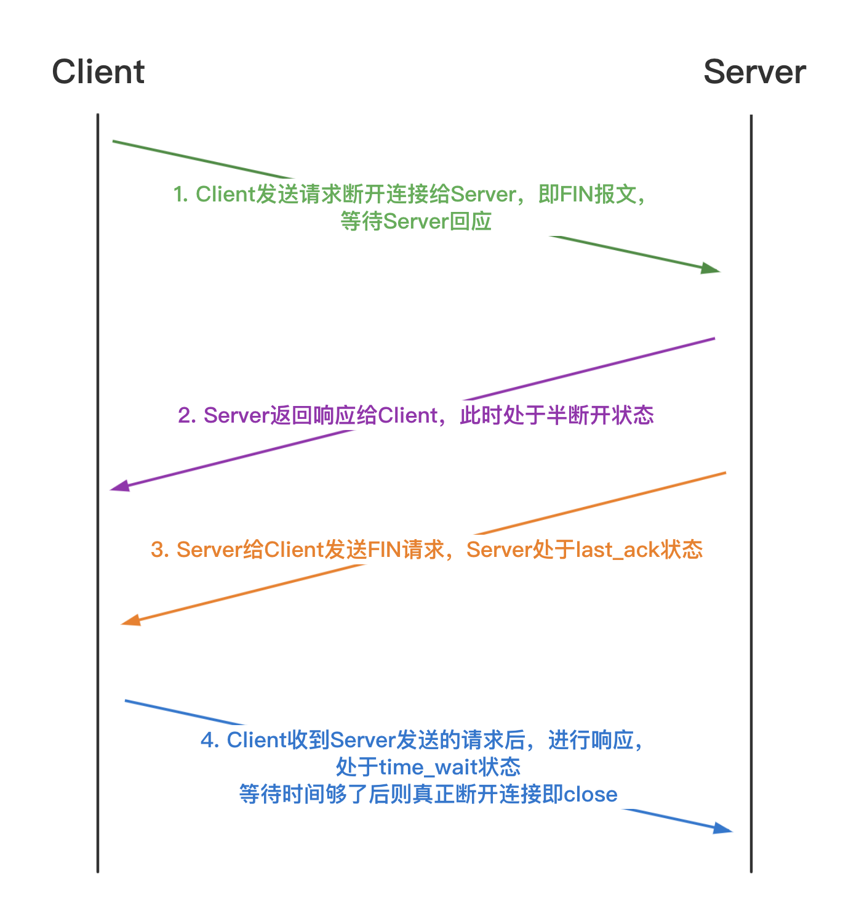
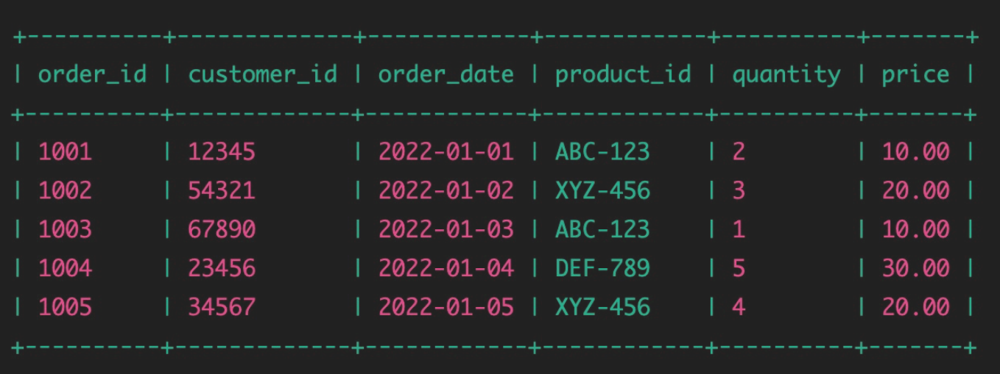

## 计算机网络篇
#### 1、HTTP 和 HTTPS 的区别
- **安全性：HTTP传输的数据是未加密的，容易被窃听和篡改。而HTTPS则提供了加密传输和身份验证，保障了数据的安全性和完整性**。
- **端口：HTTP默认使用80端口，HTTPS则使用443端口**。
- **性能**：**HTTPS由于加密处理**，相比HTTP有轻微的性能开销，但对用户而言这通常是不明显的。
- **应用场景**：**HTTPS适用于需要保护数据安全的场合**，比如在线支付和敏感信息的传输，而**HTTP则用于不涉及敏感信息的普通网页浏览**。
#### 2、HTTP 的报文结构
- **HTTP请求报文**：一个HTTP请求报文由**请求行、请求头部、空行和请求数据4个部分组成**。
- **HTTP响应报文**：HTTP响应也由三个部分组成，分别是：**状态行、消息报头、响应正文**。
#### 3、cookie 和 session 机制的区别
答1：
- **cookies 数据保存在客户端，session 数据保存在服务器端**；
- **cookies 可以减轻服务器压力，但是不安全，容易进行 cookies 欺骗**；
- **session 较安全，但占用服务器资源**
答2：
- **cookie数据存放在客户的浏览器上，session数据放在服务器上**。而**token是接口测试时的鉴权码**，一般情况下登陆后才可以获取到token，然后在每次请求接口时需要带上token参数
- **cookie不是很安全**，别人可以分析存放在本地的cookie并进行cookie欺骗，考虑到安全应当使用session，**session会在一定时间内保存在服务器上**。当访问增多，会比较占用你服务器的性能，考虑到减轻服务器性能方面应当使用cookie
- **可以将登录信息等重要信息存放为session；其他信息需要保存，可以放在cookie**。
#### 4、TCP 和 UDP 的区别
答1：
- **TCP：面向连接，可靠的，速度慢，效率低**
- **UDP：无连接、不可靠、速度快、效率高**
答2：
- TCP 有连接；UDP 无连接（基于无状态传输）
- TCP 需要建立三次握手，含有确认、拥塞、重传机制，对系统资源要求多
- UDP 不需要一系列复杂认证，速度快；TCP 速度慢
- TCP 含有确认机制，数据可靠，有序；UDP 不可靠，无序
- TCP 面向字节流（流模式）；UDP 面向报文（数据报模式）
#### 5、TCP 为什么是三次握手和四次挥手
==**三次握手**==
**（1）第一次握手**
Client请求与Server端建立连接。
- 这里只是**尝试的请求建立连接**，A到B的连接**是否建立成功不知道**
**（2）第二次握手**
`Server`在收到 `Client` 的请求后，响应`ACK 报文` 并分配资源。
- 这里B给A的ACK报文就表示`Server`同意 `Client` 跟它建立连接。
SYN表示`Server`也想尝试 `Client` 建立连接，此时`Server`到 `Client` 的连接是否建立还不确定。
**（3）第三次握手**
`Client`给`Server`发送ACK响应。在`Server`收到 `Client`的响应之后，此时双方的连接正式建立。
==**四次挥手**==

**（1）第一次挥手**
客户端发送FIN给服务端，尝试请求断开单方的连接。
此时单方连接断开与否还不能确定，要等服务端确认，因此此时的客户端处于FIN_WAIT1状态。
**（2）第二次挥手**
服务端收到断开请求后，服务端向客户端发送ACK回应，表示能断开了。
此时只是客户端到服务端连接断开，处于半断开状态。
服务端状态为：CLOSE_WAIT
**（3）第三次挥手**
服务端给客户端发送FIN请求，此时服务端处于最后一次确认状态（LAST_ACK状态）。
此时还是没有断开连接，还得等待客户端回应。
**（4）第四次挥手**
客户端给服务端发送ACK回应。服务端收到之后，此时连接真正断开。
### 6、为什么不是两次握手？为什么要三次？
**因为真正连接的建立是要双方都建立到对方的连接。**
	如果只有两次握手，只能保证A到B的连接建立，但是B到A连接还未确认，所以第三次握手的主要作用就是A给B发送数据，如果没有第三次握手，A就不会发送数据，此时B的状态一直为等待，造成的现象就是浪费资源。
### 7、为什么要进行四次挥手？为什么三次不行？
**因为在挥手过程中会传递相关数据。其中，ACK报文是用来的应答的，SYN报文是用来同步的。**
	在B收到A的FIN请求后，不会立即关闭SOCKET，会先发送一个ACK作为回应。所以A需要等B的数据发送完成之后，B会再给A发送一个FIN请求告诉A已经结束了，此时B发送给A的两次请求不能合并，所以必须是四次挥手。
### 8、TCP为什么最后挥手后会有time_wait
- **为了保证可靠的断开TCP的双向连接，确保足够的时间让对方收到ACK包**。若客户端回复的ACK丢失，server会在超时时间到来时，重传最后一个fin包，处于TIME_WAIT状态的client可以继续回复Fin包，发送ACK。
- **保证让迟来的TCP报文段有足够的时间被识别和丢弃，避免新旧连接混淆**。有些路由器会缓存没有收到的数据包，如果新的连接开启，这些数据包可能就会和新的连接中的数据包混在一起。连接结束了，网络中的延迟报文也应该被丢弃掉，以免影响立刻建立的新连接。
### 9、GET和POST区别
GET 和 POST 既然是两种不同的请求方法，肯定还是有区别的。

| 不同点        | GET                | POST                            |
| ---------- | ------------------ | ------------------------------- |
| 请求方法       | 请求头 method 字段值为GET | 请求头 method 字段值为 POST            |
| 常用请求参数传递方式 | URL 中拼接            | 请求体 body                        |
| 请求参数格式     | urlencode          | 支持 form、json、xml、binary 等各种数据格式 |
| 请求参数长度     | 被浏览器限制（2k）         | 无限制                             |
| 安全性        | 相对较低               | 相对较高                            |
| RestFul 规范 | 无状态变化              | 数据的写入与状态修改                      |
总体来说 GET 和 POST 最重要的区别就是这几项：
- **HTTP 请求中的 method 字段不同**
- **GET 请求参数拼接在 URL 中，有长度限制，安全性相对较低**
- **POST 请求参数放在 body 中，可以支持 form、json、xml、binary 等各种数据格式，没有长度限制，安全性相对较高**
- **RestFul 规范**
    - **无状态变化的建议使用 GET**
    - **数据的写入与状态修改建议用 POST**
### 10、**常见网络状态响应码**
- 200 成功
- 30X 重定向
- 400 请求格式/语法错误
- 401 权限
- 404 资源未找到
- 405 不允许的请求方式
- 5XX 服务端错误：
- 50X 服务器内部错误
- 502错误网关
- 503服务不可用 服务器超载或者停机
- 504网关超时
### 11、浏览器输入www.baidu.com后的过程是什么（输入url到网页显示出来的全过程）
当在浏览器中输入`www.baidu.com`后，将发生以下过程：
1. **DNS解析**：浏览器首先将输入的URL解析为IP地址，并向本地域名解析器发起请求，以获取该域名对应的IP地址。
2. **TCP连接**：浏览器与服务器建立TCP连接，以便传输HTTP请求和响应。
3. **发送HTTP请求**：浏览器向服务器发送HTTP请求，请求页面的HTML文档。
4. **服务器响应**：服务器收到HTTP请求并向浏览器返回HTTP响应，响应包含HTTP状态码、响应头和响应体。
5. **客户端渲染**：浏览器收到响应后，对HTML文档进行解析，构建DOM树和CSSOM树，并进行页面布局和渲染。
6. **客户端执行**：浏览器将页面的JavaScript代码解析并执行，以实现交互和动态效果。
7. **关闭TCP连接**：浏览器收到响应后，关闭与服务器之间的TCP连接。
总之，当在浏览器中输入URL后，浏览器将通过DNS解析获取服务器的IP地址，并与服务器建立TCP连接，发送HTTP请求并接收响应，最后对响应进行解析、渲染和执行。
### 12、网络七层模型，TCP/IP模型

|OSI七层模型|TCP/IP模型|5层结构||
|---|---|---|---|
|应用层|应用层|应用层|TELENT,HTTP,DNS,FTP,SMTP,POP3|
|表示层||||
|会话层||||
|传输层|传输层|传输层|TCP/UDP|
|网络层|网络层|网络层|P,ARP,RARP,ICMP,IGMP|
|数据链路层|网络接口层|数据链路层|以太网，物理网络，LAN/WAN|
|物理层||物理层||
### 13、正向代理和反向代理的区别
正向代理和反向代理核心的区别就在于
- **客户端发送请求的时候是否知道服务端的地址**
- **代理是否指定服务端地址**
从应用场景考虑：
- 正向代理：
    - **VPN**
- 反向代理：
    - 保护和隐藏原始资源服务器
    - 加密和SSL加速
    - 负载均衡
    - 缓存静态内容
    - 压缩
    - 减速上传
    - 安全
    - 外网发布
### 14、网络协议应该怎么测
网络协议测试是一项非常重要的测试工作，因为网络协议是计算机网络中数据交换的基础。在进行网络协议测试时，我们需要关注以下几个方面：
1. **通信协议测试**：这包括测试网络协议栈的各个层次，从物理层到应用层，以确保网络协议的正常工作。在测试时，我们需要模拟各种网络环境和网络流量，以确保网络协议在不同的情况下都能正常运行。
2. **安全性测试**：在测试网络协议时，我们需要关注协议的安全性，以确保协议不会被黑客或恶意用户利用。在安全性测试中，我们需要测试协议的加密、认证和授权功能，以确保协议的安全性。
3. **性能测试**：在测试网络协议时，我们需要测试协议的性能，以确保协议在高负载情况下能够正常运行。在性能测试中，我们需要测试协议的吞吐量、响应时间和并发性能等指标，以确保协议的高性能和可扩展性。
4. **兼容性测试**：在测试网络协议时，我们需要测试协议在不同的平台和环境下的兼容性，以确保协议在各种不同的网络环境下都能正常工作。在兼容性测试中，我们需要测试协议的支持情况，例如不同的操作系统、浏览器和设备等。


## 数据库篇
### 1、SQL语句中where与 having的区别
在 SQL 查询中，**WHERE 和 HAVING 都是用于筛选数据的关键字**，但它们的使用场景和作用不同。
1. WHERE
**WHERE 关键字通常用于在查询语句中对行进行筛选**，用于筛选符合特定条件的行。它通常用于过滤基础数据，例如：`SELECT * FROM teachers WHERE city = '深圳';`
在这个例子中，WHERE 子句用于仅返回居住在深圳的讲师的行记录。
2. HAVING
**HAVING 关键字通常用于在 GROUP BY 子句中对聚合函数进行筛选**。它用于在查询返回之后，对返回的数据进行筛选，
例如：`SELECT city, COUNT(*) as count FROM teachers GROUP BY city HAVING COUNT(*) > 10;`
在这个例子中，HAVING 子句用于仅返回拥有超过 10 名讲师的城市。
在总体上，WHERE 和 HAVING 都是用于筛选数据的关键字，但它们的使用场景和作用不同。==**WHERE 用于过滤基础数据，HAVING 用于对聚合函数进行筛选**==。

简单来说，WHERE 用于筛选整个表中的记录，HAVING 用于筛选聚合函数(如 COUNT, SUM, AVG)筛选分组后的记录。 存在以下几点差异：  
- 一般情况下，WHERE 用于过滤数据行，而 HAVING 用于过滤分组。  
- WHERE 查询条件中不可以使用聚合函数，而 HAVING 查询条件中可以使用聚合函数。  
- WHERE 在数据分组前进行过滤，而 HAVING 在数据分组后进行过滤 。  
- WHERE 针对数据库文件进行过滤，而 HAVING 针对查询结果进行过滤。也就是说，WHERE 根据数据表中的字段直接进行过滤，而 HAVING 是根据前面已经查询出的字段进行过滤。  
- WHERE 查询条件中不可以使用字段别名，而 HAVING 查询条件中可以使用字段别名。  
### 2、SQL语句中IN与EXISTS的区别
在 SQL 查询中，IN 和 EXISTS 都是用于子查询的关键字，但它们的使用场景和作用不同。
- `IN`
**IN 关键字用于查询一个值是否存在于一个集合中**。
例如：`SELECT * FROM students WHERE city IN ('北京', '深圳');`
在上面例子中，`IN` 子句用于返回来自北京或深圳的学生的记录行。
- `EXISTS`
**EXISTS 关键字用于判断子查询是否返回任何行**。
例如：`SELECT * FROM homeworks h WHERE EXISTS (   SELECT * FROM students s   WHERE s.student_id = h.student_id   AND s.city = '北京' );`
在上面上面例子中，`EXISTS` 子句用于返回与来自北京的学生相关联的所有作业的记录行。
可以看到，==**`IN` 用于查询一个值是否存在于一个集合中，而 `EXISTS` 用于判断子查询是否返回任何行**==。它们的使用场景和作用不同，可以根据需要选择使用哪种关键字。
### 3、数据库表删除操作，delete，drop，truncate的区别
**delete，drop，truncate的区别**
`DELETE` 、`DROP` 和`TRUNCATE` 都是 SQL 中用于删除数据的命令，但它们的作用和使用方式有所不同。
**DELETE**
- `DELETE` ：用于删除表中的记录，不删除表本身，可以带上 `WHERE` 子句来指定删除条件。
- 例如：`DELETE FROM table_name WHERE condition;`
这条语句将会删除 `table_name` 表中满足 `condition` 条件的记录。
**DROP**
- `DROP` ：用于删除整个表，包括表结构和数据，慎重使用。
- 例如：`DROP TABLE table_name;`
这条语句将会删除 `table_name` 表及其所有数据和结构。
**TRUNCATE**
- `TRUNCATE` ：用于删除表中的所有数据，但保留表结构，效率较高，不可以带上 `WHERE` 子句。
- 例如：`TRUNCATE TABLE table_name;`
这条语句将会删除 `table_name` 表中的所有数据，但不删除表结构。

**总结**
需要注意的是，使用 `DROP` 和 `TRUNCATE` 命令都会删除表中的所有数据，但它们的执行速度和效率有所不同。一般来说，`TRUNCATE` 命令的执行速度要比 `DELETE` 命令快得多，因为它不会记录每一行被删除的日志，而是直接删除整个表。但是，如果要删除部分数据，或者需要使用 `WHERE` 子句来指定删除条件，就需要使用 `DELETE` 命令了。
### 4、什么是慢查询？慢查询的原因是什么？如何做慢查询的调优呢？
**慢查询是数据库查询执行时间超过预定时间阈值的查询**。这个阈值可以根据应用的需求来设定，一般来说，如果一个查询需要花费几秒甚至更多的时间来获取结果，那它就可以被认为是慢查询。
慢查询的原因可以有很多，常见的原因包括：
1. **数据库设计不合理**：例如数据冗余过多、表结构不合理等。
2. **缺少适当的索引**：索引可以帮助数据库更快地找到数据。如果没有正确的索引，数据库可能需要全表扫描，这会花费更多的时间。
3. **查询设计不合理**：例如查询使用了复杂的联接、子查询，或者查询条件设计的不合理等。
4. **硬件瓶颈**：如I/O瓶颈，CPU瓶颈等。
5. **数据库系统参数设置不合适**。
对于**慢查询的调优**，通常可以采取以下步骤：
1. **找出问题**：首先，你需要知道哪些查询是慢查询。许多数据库系统提供了慢查询日志，可以帮助你找到执行时间超过一定阈值的查询。
2. **分析问题**：找到慢查询后，你需要分析造成慢查询的原因。工具如MySQL的EXPLAIN命令可以帮助你理解查询的执行计划，如何访问表和索引等。
3. **优化查询**：基于你的分析结果，优化查询。可能的优化措施包括改变查询结构，添加或修改索引，或者改变表的结构。
4. **测试优化效果**：在测试环境中测试你的优化措施，看看是否真的提高了查询的性能。
5. **部署优化**：如果测试结果满意，就可以在生产环境中部署优化。
6. **持续监控**：即使你对查询进行了优化，也需要持续地监控查询的性能，因为数据的变化可能会影响到查询的性能。
### 5、数据库了解吗？说说内连接，左连接，右连接分别是什么？
拿学生表和成绩表来举例。假设学生表的四列分别代表学号，姓名，出生日期和性别。成绩表的三列分别是学号，课程编号和成绩。
学生表 student

|studentId|name|birthDate|sex|
|---|---|---|---|
|001|哈利|1991-01-01|男|
|002|赫敏|1991-05-07|女|
|003|罗恩|1991-09-11|男|
|004|金妮|1996-11-15|女|
成绩表 score

|studentId|courseId|score|
|---|---|---|
|001|C0001|90|
|001|C0002|95|
|002|C0001|100|
|002|C0003|99|
|002|C0004|100|
|005|C0002|92|
两个表都有【studentId】，也就是说，它们是可以通过相同的列【studentId】关联起来。
表连接中最常见的类型就是内连接、左连接和右连接。

|连接类型|关键词|定义|
|---|---|---|
|内连接|(INNER) JOIN|获取两个表中字段匹配关系的记录|
|左连接|LEFT (OUTER) JOIN|获取左表所有记录，右表没有对应匹配的记录时显示为 NULL|
|右连接|RIGHT (OUTER) JOIN|获取右表所有记录，左表没有对应匹配的记录时显示为 NULL
#### 内连接
获取两个表中字段匹配关系的记录，也就是两张表的交集。可以通过主外键关系做为条件来去除无用信息。

语法：
```sql
SELECT * 
FROM <表名1> [表别名1] 
INNER JOIN <表名2> [表别名2]
ON <表别名1>.<外键列>=<表别名2>.<主键列>;
```
拿学生表和成绩表来举例。查询有成绩的学生信息。
SQL 语句为
```sql
SELECT * 
FROM student st
INNER JOIN score sc
ON st.studentId=sc.studentId;
```
#### 左连接
先查询出左表，以左表为主，然后查询右表，右表中满足条件的显示出来，不满足条件的显示 NULL。
语法：
```sql
SELECT * 
FROM <表名1> [表别名1] 
LEFT [OUTER] JOIN <表名2> [表别名2]
ON <表别名1>.<外键列>=<表别名2>.<主键列>;
```
还是拿学生表和成绩表来举例。查询有信息的学生的成绩。
SQL 语句为
```sql
SELECT * 
FROM student st
LEFT JOIN score sc
ON st.studentId=sc.studentId;
```
#### 右连接
先把右表中所有记录都查询出来，以右表为主，然后查询左表，左表中满足条件的显示出来，不满足的显示 NULL。
语法：
```sql
SELECT * 
FROM <表名1> [表别名1] 
RIGHT [OUTER] JOIN <表名2> [表别名2]
ON <表别名1>.<外键列>=<表别名2>.<主键列>;
```
还是拿学生表和成绩表来举例。查询所有有成绩的学生信息。
SQL 语句为
```sql
SELECT * 
FROM student st
RIGHT JOIN score sc
ON st.studentId=sc.studentId;
```
#### 总结
**数据库就是一个以某种有组织的方式存储的数据集合，是存储和管理数据的仓库**。本质上就是存储数据的文件系统。
用户使用数据库管理系统（DBMS）对数据库进行统一管理和控制，保证数据库的安全性和完整性。平常说的数据库一般指代的就是数据库管理系统。
**关系型数据库，比如使用最广泛的 MySQL**，可以使用 SQL 结构化查询语句来进行数据库的操作。
关系型数据库中多表查询中比较常见的表连接形式分别为内连接、左连接和右连接。
- 内连接：通过关键字 (INNER) JOIN 获取两个表中字段匹配关系的记录。可以通过主外键关系做为条件来去除无用信息。
- 左连接：通过关键字 LEFT JOIN 获取左表所有记录。也就是先查询出左表，以左表为主，然后查询右表，右表中满足条件的显示出来，不满足条件的显示 NULL。
- 右连接：通过关键字 RIGHT JOIN 获取右表所有记录。也就是先把右表中所有记录都查询出来，以右表为主，然后查询左表，左表中满足条件的显示出来，不满足的显示 NULL。
### 6、SQL数据库查询表倒数第10个数据
```sql
SELECT *
FROM table_name
ORDER BY primary_key DESC
LIMIT 1 OFFSET 9;
```
解释：
- `SELECT *`：选择返回结果中的所有字段。
- `FROM table_name`：选择要查询的表名。
- `ORDER BY primary_key DESC`：按照倒序方式根据主键字段排序。
- `LIMIT 1`：限制返回结果集中的行数为 1。
- `OFFSET 9`：从结果集中的第 10 行开始返回结果。
需要注意的是该 SQL 语句假定主键字段排序是以倒序方式排列的，如果是顺序排列，则需要将 `ORDER BY` 子句中的 `DESC` 关键字去掉，将 `LIMIT` 子句中的 `OFFSET` 值修改为表中总行数减去 10。
### 7、索引的优缺点，怎么用。联合索引让你选择（最左原则）。最左原则是啥
索引是一种特殊的数据结构，它能够帮助数据库高效地查询数据。索引具有以下优点：
1. **提高查询速度**：索引能够帮助数据库快速定位需要查询的数据，从而提高查询速度。
2. **减少磁盘 I/O**：索引能够减少磁盘 I/O 操作，从而提高查询效率。
3. **加速数据的排序和分组**：索引能够加速数据的排序和分组操作，从而提高数据库的性能。
4. **提高数据的完整性和一致性**：索引可以确保数据的完整性和一致性，从而提高数据的质量。
索引也有以下缺点：
1. **降低更新性能**：索引会增加插入、更新和删除操作的时间成本，因此在对数据库进行频繁的更新操作时，索引可能会降低性能。
2. **占用磁盘空间**：索引需要占用磁盘空间，因此在数据量较大的情况下，索引可能会占用大量的磁盘空间。
3. **资源占用**：索引需要占用计算机的 CPU、内存和磁盘 I/O 等资源，因此在使用索引时需要平衡资源的使用。
在使用索引时，需要考虑以下几点：
1. **选择合适的列作为索引：应该选择那些经常被查询和筛选的列作为索引**。
2. **避免过多的索引：索引过多会导致磁盘空间和内存资源的浪费，因此应该避免过多的索引**。
3. **理解联合索引的最左原则：联合索引是指在多个列上创建的索引。最左原则是指在使用联合索引进行查询时，必须从左往右依次使用索引中的列，并且遵守列的顺序，否则索引将会失效**。
最左原则是指在使用联合索引进行查询时，必须从左往右依次使用索引中的列，并且遵守列的顺序。如果不遵守最左原则，将会导致索引失效，从而降低查询的效率。因此，在使用联合索引时，需要根据最左原则来优化查询语句。
### 8、数据库事务、主键与外键的区别？
数据库事务、主键和外键是关系型数据库中的三个重要概念，它们有以下区别：
1. 数据库事务：事务是指一组数据库操作，这些操作要么全部执行成功，要么全部执行失败。如果其中任何一个操作失败，整个事务都会被回滚，恢复到事务开始之前的状态。事务能够确保数据库的一致性和完整性，防止数据错误和损失。
2. 主键：主键是用于唯一标识一张表中每一行数据的字段或者字段集合。它确保了表中每一行数据的唯一性，通常是通过在该字段上创建唯一索引来实现的。主键能够在表中保证数据的完整性和一致性，而且它还可以用于与其他表进行关联。
3. 外键：外键是一张表中的字段，它与另一张表的主键相关联。外键关系用于连接两张表，保证数据的一致性和完整性。外键的作用是在子表中建立对主表中行的引用，保证了在子表中只能插入在主表中存在的值。外键也可以有多个字段构成。
总结：数据库事务、主键和外键都是关系型数据库中的重要概念，它们有着不同的作用和用途。事务用于保证一组数据库操作的原子性、一致性、隔离性和持久性。主键用于唯一标识每一行数据，外键用于连接两张表的数据。在数据库设计和优化中，正确使用和合理应用这些概念可以提高数据的完整性、一致性和查询效率。
### 9、导致数据库性能差的可能原因有哪些？
数据库性能差的原因可能包括：
1. **硬件资源不足**：如果服务器的硬件（如CPU、内存、磁盘、网络等）不足，可能会导致数据库性能下降。例如，如果磁盘I/O不够，查询和写入数据库就需要更多的时间。
2. **索引不足或不正确**：索引是改善数据库查询性能的重要工具。如果没有正确的索引，数据库需要执行全表扫描，这会花费更多的时间。同样，过度索引也可能导致性能问题，因为每次数据变化时，所有的索引都需要更新。
3. **查询优化不当**：数据库查询可能因为多种原因而没被优化，例如，使用了复杂的联接和子查询，或者查询本身设计不合理。这可能导致数据库花费更多的时间来处理查询。
4. **并发量过大**：如果太多的用户或应用程序同时访问数据库，可能会导致性能问题。特别是当大量的写操作同时发生时，可能会导致锁定问题和性能下降。
5. **数据和日志文件的布局不合理**：如果数据文件和日志文件在同一个磁盘上，会增加I/O操作的数量，从而影响性能。
6. **数据库的配置不合适**：如果数据库的配置参数（如内存分配、并发控制等）不合适，可能会影响数据库性能。
7. **数据库设计不良**：如数据冗余过多、表结构不合理等也会影响数据库性能。
8. **磁盘碎片过多**：数据库中的数据如果过于碎片化，可能会导致查询性能下降。
以上都是可能影响数据库性能的因素，具体情况还需要具体分析，通过监控和诊断工具来找出瓶颈，然后进行相应的优化。
### 10、死锁（悲观锁、乐观锁）及如何解决、读写锁
**死锁**是指两个或更多的处理任务互相等待对方所占有的资源，造成的一种阻塞状态。在数据库中，一个事务在等待另一个事务释放资源，而另一个事务也在等待第一个事务释放资源，形成了循环等待，这就是死锁。
**悲观锁**是指在数据被访问时立即加锁，直到事务结束才释放锁。悲观锁假定数据很可能会被其他事务修改，因此在数据被访问时立即加锁，这样可以确保数据访问的独占性。但这种方式在高并发的情况下，会导致大量的事务堵塞，进而影响系统的性能。
**乐观锁**则与悲观锁相反，它假定数据一般情况下不会发生冲突，所以在访问记录时不会加锁，而是在更新数据时才会检查是否存在其他事务对数据进行了修改。乐观锁适用于读多写少的应用场景，可以降低锁的开销，提高系统的并发能力。
**解决死锁**的方法通常包括以下几种：
1. **设置锁超时**：为数据库设置锁超时时间，超过这个时间仍然不能获得资源的事务将被回滚。
2. **死锁检测**：数据库系统通过死锁检测机制，检测到死锁后，主动打破死锁，通常是终止部分事务，回滚操作，释放资源。
3. **顺序访问资源**：事务访问资源的顺序一致，可以避免死锁。
**读写锁**是一种并发控制机制，允许多个读操作同时进行，但是在写操作执行的时候，必须确保没有其他的读写操作。也就是说，读锁是共享的，写锁是独占的。在实现中，当一个线程进行写操作时会先获取写锁，在此期间，其他的读写操作都会被阻塞；当一个线程进行读操作时，如果没有线程持有写锁，则可以获取读锁进行读操作，否则会被阻塞。在读操作完成后需要释放读锁，写操作完成后需要释放写锁。
### 11、mysql怎么删除表、清空表
在MySQL中，删除表和清空表的命令如下：
**删除表：==如果你要删除整个表，你可以使用 `DROP TABLE` 命令**==。
例如，如果你有一个名为 `myTable` 的表，你想要删除这个表，你可以运行以下命令：
```sql
DROP TABLE myTable;
```
请注意，这将删除整个表，包括表结构和所有的数据。所以在执行这个命令之前，一定要确保你真的要删除这个表。
**清空表：==如果你只是想删除表中的所有数据，但是希望保留表结构（例如列名、数据类型等），你可以使用 `TRUNCATE TABLE` 命令**==。
例如，如果你想清空 `myTable` 表中的所有数据，你可以运行以下命令：
```sql
TRUNCATE TABLE myTable;
```
这个命令将删除表中的所有数据，但是保留表结构。
请注意，==这两个操作都是**不可逆的**==，所以在执行这些命令之前，必须要确保你的操作。如果可能的话，==最好在操作之前备份你的数据==。
### 12、mysql索引的存储结构是怎么设计的？——困难
MySQL主要使用B+树作为索引的数据结构。B+树是一种自平衡的搜索树，可以保持数据有序，这使得在MySQL中实现范围查询和排序非常方便。以下是关于B+树在MySQL索引中的一些关键特性：
1. **所有的叶节点都在同一层**：这为B+树带来了平衡性，保证了在查找数据时的最坏情况性能，同时也提高了在大部分情况下查找的效率。
2. **叶节点包含所有的键值和指向记录的指针**：这使得范围查询更加高效，因为找到范围的开始节点后，只需顺着叶节点层进行扫描即可。
3. **非叶节点不保存数据，只保存子节点的引用**：这使得一个节点可以存储更多的键，从而减少了树的高度，提高了查询速度。
4. **树中的每个节点都包含有序的键和指向子节点的指针**：这使得B+树可以利用二分搜索算法进行高效的键值查找。
MySQL中主要有两种类型的索引，即聚集索引和非聚集索引。聚集索引是按照主键排序存储记录的，因此一张表只能有一个聚集索引。非聚集索引是存储了键值和一个指向实际记录行的指针的索引，一张表可以有多个非聚集索引。
在设计索引时，需要考虑的因素有数据的独特性、查询的类型和频率、数据的大小和分布等，以确保索引可以提高查询性能，而不是成为维护的负担。
### 13、SQL面试题：给一个字段，对其进行从大到小排序，取前十行。
答：`SELECT * FROM 表名称 ORDER BY 字段名称 DESC LIMIT 10;`
### 14、HashMap 和 HashTable 的区别
HashMap和Hashtable是Java中两种常用的哈希表数据结构，它们都实现了Map接口，但它们在设计和实现上有显著的区别。以下是它们的主要区别：
1. **线程安全性**：
    - **Hashtable** 是线程安全的，其内部方法基本都经过 synchronized 修饰，因此可以被多个线程同时访问。
    - **HashMap** 则是非线程安全的，这意味着在多线程环境下使用时可能会导致数据不一致的问题，除非进行额外的同步控制。
2. **对 null 值的支持**：
    - **Hashtable** 不允许键或值为 null。
    - **HashMap** 允许键为 null，但不允许值为 null。
3. **实现方式**：
    - **Hashtable** 继承自 Dictionary 类，并实现了 Map、Cloneable 和 java.io.Serializable 接口。
    - **HashMap** 继承自 AbstractMap 类，并实现了 Map、Cloneable 和 java.io.Serializable 接口。
4. **初始化容量和扩容策略**：
    - **Hashtable**的初始容量为 11，而**HashMap** 的初始容量为 16。
    - **Hashtable**扩容时将容量变为原来的 2 倍加 1，而**HashMap** 扩容时将容量变为原来的 2 倍。
5. **性能差异**：
    - 因为 **Hashtable**是线程安全的，所以它的效率通常低于**HashMap**。如果不需要线程安全，推荐使用 **HashMap** 来提高性能。
6. **遍历方式**：
    - **Hashtable** 可以通过 enumerator 和 iterator 进行遍历。
    - **HashMap** 只能通过 iterator 进行遍历。
7. **其他特性**：
    - **Hashtable**提供了 contains 方法，而**HashMap** 没有这个方法。
    - **Hashtable** 的迭代器是失败安全的，即如果迭代过程中修改了集合，迭代器会抛出 ConcurrentModificationException 异常。
### 15、有一个名为 "sales" 的表，其中包含以下字段：order_id, customer_id, order_date, product_id, quantity, price。查询 2022 年销售订单的数据。

答案  
SQL解法1
```sql
SELECT *  
FROM sales  
WHERE order_date BETWEEN '2022-01-01' AND '2022-12-31';  
```
注意，这个查询假设`order_date`列包含日期时间戳，而不是仅包含日期。如果`order_date`列仅包含日期，则可以将日期字符串中的时间部分设置为`00:00:00`或使用`DATE(order_date)`函数来提取日期部分。  
SQL解法2
```sql
SELECT *  
FROM sales  
WHERE order_date >= '2022-01-01' AND order_date < '2023-01-01';  
```
从表"sales"中选择所有字段，并筛选出"order_date"在2022年的订单数据。  
注意，查询条件使用了大于等于2022 年1月1日并且小于2023年1月1日的日期范围，这样可以确保仅返回2022年的数据。  
SQL解法3
```sql
SELECT *  
FROM sales  
WHERE YEAR(order_date) = 2022;
```
这个查询语句将从"sales"表中选择所有"order_date"字段年份为2022的数据，即查询2022年的销售订单数据。  
如果只想选择特定字段，可以将`"*"`替换为您需要选择的字段名称。  
SQL解法4
```sql
SELECT *  
FROM sales  
WHERE date_format(order_date, '%Y') = '2022';
```
使用date_format函数来提取日期中的年份，然后将其与2022进行比较。  
date_format函数返回的是字符串类型的年份值，将其与字符串"2022"进行比较
