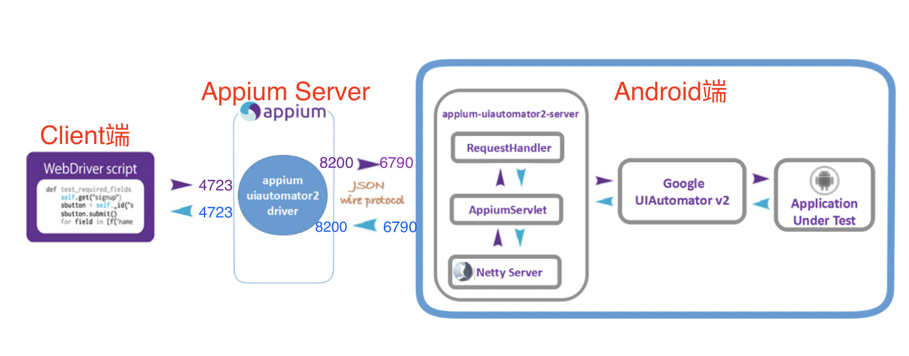

### 1、自动化测试的目的？
自动化测试的目的是为了提高软件质量和效率。以下是自动化测试的主要目的：
1. **提高测试的准确性和可靠性**
   自动化测试可以消除人为错误，减少测试过程中的手动操作，增加测试的准确性和可靠性。自动化测试可以模拟真实用户行为，覆盖更多的测试场景，减少遗漏和漏洞。
2. **提高测试的效率和速度**
   自动化测试可以快速执行测试用例，并在短时间内获取测试结果。相比手动测试，自动化测试可以大幅度缩短测试时间和成本，提高测试效率和速度。
3. **促进持续集成和持续交付**
   自动化测试可以实现持续集成和持续交付，降低软件发布的风险和成本。自动化测试可以在每次代码提交后自动执行测试，及时发现和修复问题，并确保软件的稳定性和可靠性。
4. **增强测试的可重复性和可维护性**
   自动化测试可以实现测试用例的重复执行，并保证测试结果的一致性和可靠性。自动化测试还可以提高测试用例的可维护性，便于测试人员对测试脚本进行维护和更新。
### 2、实际工作中，你是如何开展自动化工作的？
自动化测试工作开展流程：
第一、需求分析。根据产品的业务特性整理出一个可以做自动化的功能模块
第二、制定测试计划：根据业务特性、业务复杂性、任务优先级、以及人员现状来制定自动化测试计划；
第三、设计自动化用例：从功能用例中挑选合适的用例来转成自动化用例；
第四、框架选型。选择合适的编程语言、自动化工具、完成环境的搭建
第五、编写/调试脚本：自动化测试的脚本开发与调试
第六、执行测试：根据项目来制定自动化的执行方案；
第七、测试报告：整理测试报告并开展分析工作，接着汇报自动化测试成果
第八、后期维护：跟进框架与脚本的后期维护
### 3、Web自动化测试的意义
- **回归测试**
- **可以执行手工测试很难实现或者很耗时的测试工作**，比如并发测试、压力测试
- **能够更好的利用资源，节省时间和人力成本**
### 4、Selenium面试题：Selenium原理

Selenium 实现自动化测试，主要由三部分在工作：
- 客户端脚本（Client）
- 浏览器驱动（Driver）
- 浏览器（Browser）
1. 开始执行测试时，测试用例会作为Client端，用例调用 Selenium 库的API， 完成对浏览器驱动的启动，此是驱动会开通一个端口，用来接收请求
2. 当浏览器驱动Driver 接收到客户端Client的请求，会将请求通过另一端口实现转发，转发给浏览器，执行相应的指令
3. 浏览器执行完成相应指令，会将结果返回给浏览器驱动，浏览器驱动最终将结果返回给Client。
4. 客户端在向浏览器驱动发送请求的时候遵循了一个协议 WebDriver WireProtocal 。

即测试工程师通过编写自动化脚本模拟用户操作，自动化脚本通过向WebDriver发送请求，调用不同的浏览器驱动来控制浏览器。WebDriver在启动服务后，开始监听请求。一旦收到请求，就会解析请求，执行相应的操作，例如点击按钮，输入内容等，最后将结果返回。
### 5、Appium工作原理
#### Appium框架介绍
首先，Appium 是一款开源框架，生态丰富，社区强大，一直在被开发者维护；
并且是一个灵活的**跨平台**的测试自动化工具，可以在iOS、Android 或 Windows、Mac 设备上进行移动应用的自动化测试运行，并且能够使用相同的 API 编写多个平台的测试脚本；
Appium与Selenium类似，是一个**跨语言**的自动化框架，并且可以和任何测试框架相结合；可以使用不同的编程语言编写测试脚本，包括 Java、JavaScript、PHP、Ruby、Python 和 C#。

1. `Client`端发送操作指令给`Appium Server`
2. `Appium Server`通过`appium-uiautomator2-driver`发送`JWP`协议的请求到`Android`的`appium-uiautomator2-server`
3. `appium-uiautomator2-server`调用`Android`系统的 `Google UIAutomator2` 去以执行自动化具体的操作
4. 操作完成后返回结果对象`AppiumResponse`给`appium-uiautomator2-driver`，`AppiumServer`再返回给`Client`端，`Client`端得到最终执行操作的结果
注意
- `appium-uiautomator2`的`driver`和`server`之间的通信的协议是JWP协议
- 创建`AndroidDriver`遵循的是`W3C`协议进行创建
### 6、简述 PageObject 设计模式
#### 介绍
`Page Object Model` 也称为 `POM`/`PO`，是 `Selenium` 中的一种设计模式，它创建类对象来存储页面元素及相关操作；  
其中，可以将被测应用的每个页面视为一个class类，并且每个class类包含当前页面相关的元素及其相关操作的方法。
#### 理解
可以从两个方面进行理解：一个是class类对应的属性，一个是class类对应的方法。


#### 属性
首先，从类的属性上进行说明。一个页面对应一个class类，当前页面的元素定位则表示为当前类的成员变量。
由于元素只属于当前页面，所以类的成员变量不可以暴露给外部，即对应页面元素定位需要设置为私有化属性；
一个页面对应的操作有可能只涉及到当前页面的某几个元素，很少会涉及页面的所有元素，所以在一个类里面不需要建模当前页面的所有元素。
#### 方法
其次，从类的方法上进行说明。一个class类可以包含多个操作方法，对应的每个方法都是当前页面可进行的操作。
如果操作完成后页面会跳转，则对应方法需要返回其他页面的class类；如果操作完成后页面会返回用于断言的数据，则对应方法则需要返回存放数据的Object。
每一个类里面的方法都是需要测试用例去进行调用，则Class类中的method方法需要作为公共方法。
如果在一个页面进行相同的操作，会造成不同的结果，则编写class类的方法时需要建模为不同的方法。
最后，所有的测试用例断言都是在测试方法调用时进行，编写PO内的方法时不可以在方法内添加断言，只可返回断言相关数据给测试方法调用时获取。
#### 优点
`PO`设计模式主要应用在自动化中，有助于减少代码重复并改进测试用例维护。
### 7、接口测试能发现哪些问题？
做接口测试可以发现很多在页面上操作发现不了的 Bug：
- 可以检验接口是否按照约定返回响应
- 可以修改请求参数，突破前端页面输入限制，检验系统的异常处理能力。比如边界值处理错误，输入异常值接口抛异常，输入参数多或者少接口抛异常等等
- 可以检验系统的安全性。比如明文传输、返回结果含有敏感信息，没对用户身份信息做校验，没做恶意请求拦截等等
- 可以通过接口测试并发场景，检验系统的性能和稳定性。比如接口并发多条相同操作，响应时间过长，接口压测出现瓶颈等等
通过接口测试，可以让接口质量得到保证，这样前端也会更稳定，功能测试专注与发现前端的 Bug 即可。
### 8、Selenium面试题：Selenium Grid作用是什么? Selenium Grid的使用过程？
### 9、接口测试中怎么用接口用例去覆盖业务逻辑？
接口测试用例设计的目标就是验证接口是否按照预期工作，需遵循接口文档要求，包括请求参数、响应结果和异常处理等，并尽可能覆盖所有可能的业务逻辑。
以下是如何使用接口测试用例覆盖业务逻辑的一些方法：
1. **理解业务逻辑**：首先，需要深入理解业务逻辑和接口功能。只有明白接口预期的行为和输出，才能有效地设计出覆盖所有场景的测试用例。
2. **正常流程测试**：编写测试用例，覆盖接口预期的正常业务流程。比如测试接口返回正确的数据，符合预期的状态码等。
3. **边界情况测试**：测试接口在边界情况下的表现，如请求参数接近最大/最小值，或者正好是最大/最小值的时候，接口是否能正确处理。
4. **异常流程测试**：测试接口在异常情况下的表现，比如提供错误的参数，或者模拟服务器错误的时候，接口是否有合适的错误处理机制。
5. **压力测试**：测试接口在高并发和大数据量的情况下的表现，以确保接口在压力下也能正常工作。
6. **安全性测试**：测试接口的安全性，比如是否有防止SQL注入，XSS攻击等安全机制。
7. **兼容性测试**：测试接口在不同环境（例如不同的操作系统，不同的网络环境）下的兼容性。
8. **状态转换测试**：如果接口有依赖性或是顺序性，如登录接口后才能调用查询接口，需要考虑业务流程的顺序，测试各种状态下接口的表现。
通过以上这些方式，就可以尽可能全面地覆盖接口的业务逻辑。不过请注意，不同业务场景的复杂性不同，需要根据实际情况灵活调整测试策略。
### 10、如果没有接口文档，如何开展接口测试
1. 使用浏览器开发者工具或抓包工具，捕获网络请求和响应信息，了解应用程序中的请求类型、参数和响应数据。
2. 如果能看到程序源码，可以尝试查找API相关的代码段。一些框架和库可能会有内置的路由器和控制器，可以帮助你了解API的端点和参数。
3. 查看程序日志，采集接口请求与响应相关的日志信息。
4. 使用第三方工具，或者编写脚本对相关接口编写测试用例并执行测试。
### 11、接口测试的优势
1. **高效**：接口测试比界面测试更快。
2. **可重复性**：接口测试可以编写自动化测试脚本，保证测试的可重复性。
3. **覆盖范围更广**：接口测试可以测试应用程序的每个接口，覆盖更广泛的测试场景。
4. **稳定性更好**：接口测试可以发现和解决应用程序接口的问题，提高应用程序的稳定性和可靠**性。
5. **易于集成**：接口测试可以更容易地集成到持续集成/持续交付流程中。
6. **提前发现问题：接口测试可以早期检测到问题。
7. **更好的协作**：接口测试鼓励团队之间更好的协作。
8. **提高安全性**：接口测试有助于识别安全漏洞。
9. **成本效益**：接口测试比其他形式的测试更具成本效益。
10. **更好的用户体验**：接口测试有助于确保软件易于使用并提供良好的用户体验。
总之，==**接口测试优势包括高效、可重复性、覆盖范围更广、稳定性更好、易于集成、提前发现问题、更好的协作、提高安全性、成本效益和更好的用户体验**==。通过将接口测试纳入软件开发生命周期，可以确保软件经过全面测试并提供良好的用户体验。
### 12、接口测试中如果接口出现异常，该如何分析异常原因
要分析接口异常的原因，可以遵循以下步骤：
1. **查看日志**
    如果接口使用了日志系统，可以查看日志文件以了解接口在运行时的详细情况，包括请求参数、返回结果、异常堆栈信息等。
2. **抓包分析**
    使用抓包工具可以捕获网络流量，包括请求和响应的数据包，然后对这些数据进行分析
3. **分析代码** 
    检查异常对应代码中可能出现的空指针、数组越界等异常情况。
4. **联系开发人员**
    如果无法找到问题所在，可以联系开发人员，以协助排查问题。
### 13、接口测试中如何测试身份验证和授权
1. **用户登录测试**：在登录页面上测试输入有效和无效的用户名和密码，以确保只有正确的凭据才能登录。还可以测试登录的过程中出现的错误消息和提示是否正确。
2. **权限测试**：测试用户是否可以访问他们有权访问的资源和功能。例如，测试一个普通用户是否可以访问管理员权限下的功能。
3. **注销测试**：测试用户注销功能是否正常工作，确保在注销后用户无法访问需要登录才能访问的资源。
4. **安全性测试**：测试应用程序是否存在安全漏洞，例如跨站脚本攻击、SQL注入攻击等。
5. **API测试**：测试API是否需要身份验证和授权，以及API请求是否需要正确的授权令牌。
6. **会话管理测试**：测试应用程序的会话管理是否正常工作，以确保只有经过身份验证的用户可以访问应用程序的资源。
7. **多因素身份验证测试**：测试多因素身份验证是否正常工作，例如测试用户是否能够成功接收并输入正确的安全代码或短信验证码。
### 14、什么是Mock测试
- Mock测试就是在测试活动中，对于某些不容易构造或者不容易获取的比较复杂的数据/场景，用一个虚拟的对象（Mock对象）来创建用于测试的测试方法。
- Mock 测试的主要目的是在早期阶段发现并解决软件缺陷，同时也可以在整个软件开发周期中提高测试覆盖率和减少测试成本。Mock 测试可以帮助测试人员识别软件系统中的潜在问题，并验证系统的正确性、可靠性和安全性。  
- 在进行 Mock 测试时，测试人员可以根据需要编写 Mock 对象的实现，以便控制和模拟系统的各种行为。例如，在测试一个购物车系统时，可以使用Mock 对象来模拟与支付系统的交互，以便测试购物车系统的行为是否正确。  
- 总之，Mock 测试是一种有助于提高软件测试质量和效率的测试方法，它可以帮助测试人员快速发现和解决潜在的软件缺陷，并提高测试覆盖率和降低测试成本。
### 15、自动化测试如何处理验证码
自动化测试中处理验证码的方法，可以分为产品上线前与产品上线后两种情况，也就是测试环境和生产环境。对于上线前，要处理验证码有两种解决办法给大家提供两种思路：
- 第一、让开发帮忙设置个万能验证码，比如1234。但是一定要注意只能是测试环境生效，生产环境要删掉。
- 第二、可以将我们的一个或者多个帐号添加到白名单，白名单的用户可以直接跳过验证。
那如果产品上线后，我们也有方法能跳过登录，这里给大家推荐两种方法
- 第一、使用cookie跳过，使用抓包工具，或者通过代码将登录的cookie信息保存下来，因为cookie里保存了用户的登录信息，在cookie有效期内执行用例，就可以跳过登录了。
- 第二、可以使用验证码自动识别技术，也就是图像识别技术，比如Java 可以使用 Test4J，Python可以使用 tesseract-ocr ，需要注意的时候图像识别对于有的字符可能识别率没有那么高，比如有可能C会被识别为O。
### 16、什么是断言？
断言是指检查一个条件，如果它为真，就不做任何事，用例通过；如果它为假，则会抛出 AssertError 并且包含错误信息。
### 17、Android与iOS在app测试时有哪些区别？
下面我们从五方面来说一下测试时Android与iOS系统的区别：
- **第一点、安装测试**，这里分为两个版本，测试版本与线上版本，对于线上版本，Android 系统的安装渠道比较多，比如：各个手机自带的应用市场或者第三方的手机助手等。iOS可以通过 AppStore 或者iTunes进行下载安装。  
    对于测试版本，Android非常简单，只需要提供一个apk文件就可以在任何设备上进行安装。iOS较为复杂，没有经过苹果审核是不允许安装的，所以要安装iOS的测试版本，需要将设备添加到开发者帐号，或者使用testlight工具。
- **第二点、对于兼容性测试**，Android 操作系统是开源的，很多不同厂商在这个基础上进行了二次开发，所以导致出现的操作系统类型以及版本都非常多，比较常见主流的有：华为、小米、OPPO，Vivo等，还有很多比较小众非主流的操作系统；而且每个系统都有很多的版本，包括大版本和小版本；以及每个厂商的手机屏幕大小也差异比较大，所以Android 应用的兼容性测试就会比较复杂一些
相对于iOS就只有单一的苹果系统，虽然也经常更新版本，但是随着苹果官方系统版本的升级，一般我们只需要维护最新的几个主流版本的兼容性测试即可；选取的主流系统版本，再覆盖iOS的几款主流的屏幕大小的机型，兼容性测试会相对来说简单很多。
- **第三点、对于升级测试**，ios限制也比Android多一些。iOS有严格的降级限制，最开始只能单向升级，不能降级。Android系统的降级限制没有那么严格，通过一定的工具都可以降级成功。
- **第四点、权限测试**，Android众所周知的就是Android的个人信息泄露比较严重的，比如很多app在安装时会要求很多权限，Android系统会提示是否允许获取手机的某个权限，但是即使用户不给，Android也有各自手段偷偷的获取这些权限，所以Android APP的这种权限测试不是很严格。
而iOS一般情况下权限管理的很严格，用户没有同意的权限，APP是一定没有办法绕过并获取的，所以应用不会去获取一些没有意义的权限；而且应用要上线苹果商店时，苹果官方的审核机制也是比较严格，经常会出现审核不通过的情况。所以ios的权限一般情况下会要的很少。
- **第五点、消息推送测试**，由于两个操作系统的消息推送渠道不同，Android 一般使用第三方或者自建的平台进行消息推送，iOS 消息推送渠道是由苹果官方提供的。
### 18、在做UI自动化时，使用UI自动化测试工具进行自动化测试，一个元素明明定位到了，点击无效（也没报错），如果解决？
答：
- 方法一：页面上有的时候元素点了没有反应（比如时间日期组件），**可以通过 js 操作**。
- 方法二：有的页面中按钮属性加载较慢，虽然能定位到这个元素，但还未加载出可点击属性，点了没有反应，这时可以使用显式等待，封装一个方法，如果点了没有反应，则**利用显式等待，等一段时间再点一次，如果在显等的时间内，点了都没有反应，则抛出异常**。
### 19、使用UI自动化测试工具进行自动化测试，如何通过子元素定位父元素?
答：
- 方法一：通过 `element/..` 定位父结果，例如：
`# 查找节点的父节点  $x('//*[@id="site-logo"]/..')`
- 方法二：通过 `parent::*`定位父元素，例如：
`# 查找节点的父节点  $x('//*[@id="site-logo"]/parent::*')`
### 20、UI自动化-如何判断一个页面上元素是否存在？
答：
- 方法一：通过异常处理来判断元素是否存在，**可以使用 `try…except…` f 未找到元素的时候捕获这个异常**。
- 方法二：**通过查找元素列表`find_elements()` 判断元素是否存在**，定义一个方法，如果元素列表大于 0 则元素存在，返回 True, 如果元素列表等于 0 则元素不存在，返回 False
- 方法三：**显式等待，结合 WebDriverWait 和 expected_conditions 判断**（推荐）
### 21、接口自动化中假如报文返回1000个字段，怎么确保这些字段都是正确的
答：
- **响应的完整性与类型测试**
	如果要完成响应信息的完整性测试，使用 JsonSchema 自动生成响应对应的模版信息，然后每次与模版进行对比即可，如果响应发生变化，也可以重新生成模板，相比与人工对比，更加的方便。而且不易出错。
- **响应的业务正确性的测试**
	- 变的部分，可以**通过模板技术+正常编写断言**的方式完成。
	- 不变的部分，则需要**通过 diff 技术**。保证不应该改变的业务模块没有发生变化。
### 22、在UI自动化中怎样进行浏览器的关闭操作？使用driver调用quit和调用close的区别是什么？
- Selenium API
    - ==**driver.quit()：退出当前所有的窗口**==；
    - ==**driver.close()：关闭当前的标签页，其他窗口不退出**==
场景：关闭所有的浏览器窗口，销毁driver操作，则需要使用的是quit方法；当打开了多个窗口，只想要关闭非最后一个窗口的时候，使用的是close方法。
- quit:所有的浏览器窗口退出
```python
@Test
public void quit() throws InterruptedException {
    WebDriver webDriver = WebDriverManager.chromedriver().create();
    webDriver.get("https://www.baidu.com/");
    webDriver.findElement(By.linkText("新闻")).click();
    sleep(5000);
    //输出当前的窗口
    Set<String> windowHandles = webDriver.getWindowHandles();
    System.out.println(windowHandles);
    sleep(3000);
    //切换到第一个窗口
    webDriver.switchTo().window(windowHandles.stream().findFirst().get());

    sleep(2000);
    System.out.println(webDriver.getWindowHandle());
    //Quits this driver, closing every associated window.
    webDriver.quit();
    sleep(6000);
}
```
- close:只关闭当前的浏览器标签页，如果当前浏览器标签页剩下最后一个，则所有标签页面退出
```python
@Test
public void close() throws InterruptedException {
        WebDriver webDriver = WebDriverManager.chromedriver().create();
        webDriver.get("https://www.baidu.com/");
        String mainHandle = webDriver.getWindowHandle();
        webDriver.findElement(By.linkText("新闻")).click();
        sleep(2000);
        //切换到第一个窗口
        webDriver.switchTo().window(mainHandle);
        sleep(2000);
        webDriver.findElement(By.linkText("图片")).click();
        sleep(2000);
        webDriver.close();//关闭第一个窗口
        System.out.println("浏览器关闭第一个窗口");
        sleep(6000);
        //切换到最后一个窗口关闭
        Set<String> handles = webDriver.getWindowHandles();
        ArrayList<String> hanleList = new ArrayList<>(handles);
        String endHandle = hanleList.get(hanleList.size() - 2);
        webDriver.switchTo().window(endHandle);
        sleep(2000);
        webDriver.close();
        System.out.println("浏览器关闭最后一个标签页");
        sleep(6000);
        }
```
### 23、显式等待和隐式等待
**显式等待**
需要定位某个元素时，但是元素有可能还未加载出来，这时就需要针对具体的元素或者页面进行显式等待条件的判断。
优点：针对指定元素或页面生效，不是整个WebDriver周期生效。所以，可以根据对应定位的元素来设置显式等待的判断条件，会节省加载其它无关文件的时间，即不需要等待页面加载完成。
缺点：必须在需要的操作前声明对应的显示等待及其判断条件，如果每个步骤都需要则需要在每个步骤前都声明。
**隐式等待**
在创建driver时声明并且只声明一次，声明后在整个WebDriver周期都生效，相当于一个全局变量。隐式等待相当于告诉driver去等待一定时间后再去执行代码操作，即当页面加载完成后，才会执行下一步。
优点：只需声明一次，不需要在每个操作步骤声明。
缺点：设置隐式等待后，对应的影响的不是某一个元素而是整个页面，只有整个页面加载完成后才会执行下一步。
页面加载完成后，如果要操作的是某个元素，则需要等当前元素的所有属性加载完成。即不只是UI加载完成，还需要对应的元素的js文件、图片等加载完成，此时会增加不必要的加载时间。
**显式等待和隐式等待的区别**
==**隐式等待可以看作全局变量，显式等待可以看作为局部变量。**==
**强制等待**：直接是线程等待，只有等待完成后才能运行代码。

| 类型   | 使用方式                                                                                                                                 | 原理             | 适用场景                          |
| ---- | ------------------------------------------------------------------------------------------------------------------------------------ | -------------- | ----------------------------- |
| 直接等待 | `Python:time.sleep(等待时间)`  <br>`Java:Thread.sleep(等待时间);`                                                                            | 强制线程等待         | 调试代码，临时性添加                    |
| 隐式等待 | `Python:driver.implicitly_wait(等待时间)`  <br>`Java:driver.manage().timeouts().implicitlyWait(等待时间);`                                   | 在时间范围内，轮询查找元素  | 解决找不到元素问题，无法解决交互问题，也无法自定义等待条件 |
| 显式等待 | `Python:WebDriverWait(driver, 最长等待时间, 执行间隔).until(条件函数)`  <br>`Java:WebElement wait = new WebDriverWait(driver,最长等待时间).until(条件函数);` | 设定特定的等待条件，轮询操作 | 解决特定条件下的等待问题，比如点击             |
### 24、Seleinum面试题：Seleinum如何切换窗口
在Selenium中，可以使用`window_handles`和`switch_to.window()`方法来切换窗口。以下是一个例子，展示如何切换到第二个窗口进行操作。

```python
from selenium import webdriver

driver = webdriver.Chrome()
driver.get("http://www.example.com")

# 点击一个链接，会打开一个新窗口
new_window_link = driver.find_element_by_id("new-window-link")
new_window_link.click()

# 切换到第二个窗口
driver.switch_to.window(driver.window_handles[1])

# 在第二个窗口中查找一个元素
element_in_new_window = driver.find_element_by_id("element-in-new-window")
element_in_new_window.click()

# 切换回到第一个窗口
driver.switch_to.window(driver.window_handles[0])
```

在这个例子中，首先使用`find_element_by_id()`方法找到一个链接元素，然后点击该链接后会打开一个新窗口。接下来，使用`window_handles`方法获取所有窗口的句柄，然后使用`switch_to.window()`方法切换到第二个窗口。在第二个窗口中查找一个元素并对其进行操作。最后，使用`switch_to.window()`方法切换回到第一个窗口。

需要注意的是，当要从一个窗口切换到另一个窗口时，需要先获取所有窗口的句柄，然后再切换到指定的窗口。否则，切换会失败。
### 25、自动化测试流程？
1. 编写自动化测试计划
2. 设计自动化测试用例
3. 编写自动化测试框架和脚本
4. 调试并维护脚本
5. 无人值守测试
6. 后期脚本维护（添加用例、开发更新版本）
### 26、什么是PO模式？
PO是Page Object 模式的简称，它是一种设计思想，意思是，把一个页面，当做一个对象，页面的元素和元素之间操作方法就是页面对象的属性和行为，PO模式一般使用三层架构，分别为：基础封装层BasePage，PO页面对象层，TestCase测试用例层。
### 27、前置接口变动了，会影响到后置的接口用例，比如后置有20条用例，你会怎么解决？
首先可以先问下面试官，是返回值变了，还是用例步骤变了。通常如果是返回值是很好处理的，只要把变量提取的地方fix一下就好。比如以前提取是。 `data[“msg”][“token”]`变动成了 `data[“token”]`，在代码结构设计合理的情况下，其实基本只要改一个地方。如果使用 `jsonpath`的话，甚至大部分情况都不需要改动，提取公式一直为`$…token`就可以了。
### 28、UI自动化你们大多什么用什么方式去定位？
- 如果是难以推动研发做改进的情况，可以回答**主要使用css、xpath的相对定位，因为可维护性更强**。
- 如果是能够推动研发做改进，**最好约定一个唯一标识，这样基本元素变动的营销可以降到最低**。（可以参考有赞的前端规范）
### 29、接口数据校检你们一般怎么做的？
一般接口返回值数据校验主要是有两大经典问题，
**第一个是返回值层级嵌套深，不好提取，可以使用==jsonpath==进行提取**。
**第二个是字段量大，且多的时候的校验，通常是通过==json schema==自动生成校验模版**。这两个工具可以覆盖大多数的接口测试的数据校验问题
### 30、作为一个高级自动化测试工程师，如果有一个你没接触过的系统，你会怎么开展工作？
一个思路清晰，经验丰富的测试工程师，工作一定是有一个好的规划的。
1. **了解整体业务架构**，有哪些业务模块，业务和业务之间的交互关系。最好是能画出来一个==**业务模型图**==
2. **了解整体技术架构**，有哪些微服务，微服务和微服务的交互关系，最好是有一个==**技术架构图**==
3. **掌握自己的被测模块，先把相关的测试用例梳理一遍**。等功能测试熟悉，了解业务和架构之后，就开始着手挑选稳定的用例，写回归的自动化测试脚本，挑选重要的用例，写冒烟的自动化测试脚本。同时把持续集成和持续交付的一整套流水线搞定。以及监控、精准化测试。根据团队的情况来一个个落地。
### 31、UI自动化中，如何做集群
- selenium grid，分布式执行用例
- appium 使用stf管理多设备
- docker+k8s管理集群
### 32、如何优化和提高selenium脚本的执行速度
- 尽量使用by_css_selector()方法：by_css_selector()方法的执行速度比by_id()方法的更快，因为源码中by_id()方法会被自动转成by_css_selector()方法处理
- 使用等待时，尽量使用显示等待，少用sleep()，尽量不用隐式等待
- 尽量减少不必要的操作：可以直接访问页面的，不要通过点击操作访问
- 并发执行测试用例：同时执行多条测试用例，降低用例间的耦合
- 有些页面加载时间长，可以中断加载
### 33、接口测试能发现哪些问题
- 可以发现很多在页面上操作发现不了的 bug
- 检查系统的异常处理能力
- 检查系统的安全性、稳定性
- 前端随便变，接口测好了，后端不用变
- 可以测试并发情况，一个账号，同时（大于 2 个请求）对最后一个商品下单，或不同账号，对最后一个商品下单
- 可以修改请求参数，突破前端页面输入限制（如金额）
### 34、接口产生的垃圾数据如何清理
- 造数据和数据清理，需用 python 连数据库了，做增删改查的操作测试用例前置操作，setUp 做数据准备后置操作，tearDown 做数据清理
### 35、如何判断一个页面上元素是否存在？
- 方法一：用 try…except…
- 方法二：用 elements 定义一组元素方法，判断元素是否存在,存在返回 True,不存返回 False
- 方法三：结合 WebDriverWait 和 expected_conditions 判断（推荐）
### 36、测试人如何选择自己的测试框架？
答：特点：**开源框架、二次开发、个性化定制、免费**
（1）选择编程语言，大部分成员都熟悉，方便开发和维护；
（2）考虑框架用例模块的可读性和易懂性；
（3）测试场景的复杂度，考虑和计算投诉成本；
（4）框架与被测系统的交互性，确保系统容易被测试；（提供自动化接口等）
（5）对于版本控制和持续集成的支持。
### 37、你平时做接口测试的过程中发现过哪些BUG？
答：
在接口测试过程中，可以发现各种类型的错误和Bug。以下是一些常见的例子：
1. **数据问题**：返回的数据可能与预期不符，例如数据格式错误，或返回了错误的数据。
2. **状态码问题**：接口可能返回错误的HTTP状态码。例如，请求成功但返回了一个错误码，或者请求失败但返回了200成功码。
3. **性能问题**：接口响应时间过长，或者在并发请求下性能下降。
4. **安全问题**：例如接口没有对输入进行适当的过滤和检查，可能导致SQL注入等安全问题。
5. **参数问题**：例如接口没有正确处理缺少必要参数，或参数值不正确的情况。
6. **兼容性问题**：在不同的环境或设备上，接口的行为可能不一致。
7. **逻辑问题**：例如接口实现的业务逻辑与需求不符。
8. **错误信息问题**：当出现错误时，接口可能没有返回有用的错误信息，这会使得排查问题变得困难。
上述只是一些常见的例子，实际上在接口测试过程中，可能会发现更多的问题，这取决于接口的复杂性以及业务需求。
### 38、接口测试怎么编写测试用例？
答：
接口测试：是指针对模块或系统间接口进行的测试。
分析一个接口：
（1）**获取API接口文档（Swagger）**；
（2）**分析接口文档，提取测试点**（输入、业务逻辑：组合输入参数、输出反向设计测试数据）；
（3）**测试用例**：同时对输入、业务逻辑、输出进行考虑时，肯定会存在用例的冗余，**在最大限度覆盖业务功能和规则下，选取最优用例集合**。同时，需要考虑异常数据和场景。
编写接口测试用例的目的是验证接口是否按预期工作，并尽可能地覆盖所有可能出现的情况。以下是编写接口测试用例的基本步骤：
1. **理解接口**：首先，你需要理解接口的功能和业务逻辑。阅读接口的文档，了解接口的请求方式（如GET，POST等），请求参数，预期的返回值和可能的错误情况。
2. **定义正常情况的测试用例**：一旦你理解了接口的功能，你可以定义一些测试用例来验证接口在正常情况下的行为。这包括提供正确的参数，检查返回的状态码是否正确，以及返回的数据是否符合预期。
3. **定义异常情况的测试用例**：你还需要定义一些测试用例来验证接口在异常情况下的行为。这包括提供错误的参数，缺少必要的参数，或者提供不符合格式要求的参数等。
4. **定义边界情况的测试用例**：考虑一些边界条件的情况，比如参数值在最大值或最小值等情况下的行为。
5. **定义性能测试用例**：如果接口需要支持大量的并发请求，你可能需要定义一些性能测试用例。例如，你可以定义一个测试用例来验证接口在高并发情况下的响应时间。
6. **定义安全测试用例**：如果接口涉及到敏感数据，你需要定义一些安全测试用例。例如，你可以定义一个测试用例来验证接口是否有防止SQL注入的机制。
7. **定义兼容性测试用例**：根据接口的应用场景，可能需要进行不同环境下的兼容性测试。
### 39、接口测试用例怎么断言的？
答：
**响应码**：检查响应码是否符合预期，用来判断测试用例是否执行成功（针对http接口）；
**关键字**：验证关键字是否符合预期，用来判断测试用例是否执行成功；
**正则匹配**：当一个接口返回的内容较多，并且有一定规律时，可通过正则表达式来校验接口；
**数据库匹配核对**：比如对查询一个接口返回的数据进行验证时，可通过编写Sql语句查询结果，然后将sql语句执行后数据库返回的结果与接口返回的结果进行核对，以此来判定测试用例是否执行成功
**通过相关接口进行辅助验证**：比如，当测试一个删除接口时，删除一条记录后，想验证这条记录真的被删除，可调用查询接口，若删除的记录没被查询到，则说明删除这条记录成功
### 40、接口用例常见的不通过场景有哪些？
答：接口测试经常遇到的bug和问题，如下：
（1）传入参数处理不当，导致程序crash；
（2）类型溢出，导致数据读出和写入不一致；
（3）因对象权限未进行校验，可以访问其他用户敏感信息；
（4）状态处理不当，导致逻辑出现错乱；
（5）逻辑校验不完善，可利用漏洞获取非正当利益等。
### 41、接口用例自动化有哪些经典的异常场景？
答：  
（1）特殊值处理不当导致程序异常退出或者崩溃
（2）类型边界溢出，导致数据读出和写入不一致
（3）取值边界外值未返回正确的错误信息
（4）参数为null或空字符串“”等异常数据
（5）权限未处理，可以访问其他用户的信息
例如：无权限可以访问，或者 一般用户可以访问管理员权限
（6）逻辑校验不完善，可利用漏洞获取非正当利益
例如：某网站兑换1块钱需要100币，当小于100币时调用后台，接口是否可以兑换
例如：购物结算时为100元，调用 后台接口设为0元
（7）状态处理不当，导致逻辑出现错误
（8）数组类型item个数为0或者item重复时程序异常退出
（9）超时问题，超时后处理
（10）潜在性能问题（后台提交处理或者把性能风险提前提出）
### 42、有了postman，jmeter 还有开源的接口自动化平台，为什么还要写代码来做自动化，你们这套自动化框架的意义是什么？
答：
Postman和Jmeter等工具确实非常强大且易用，可以进行接口测试和性能测试等，但是它们也有自己的局限性。而编写代码来做自动化测试则有以下优点：
1. **自定义程度高**：通过编写代码，我们可以根据项目的特异性设计和实现定制化的测试方案，满足更为复杂和特殊的测试需求。
2. **维护更加方便**：随着项目的迭代，接口的数量可能会持续增长，如果仅依靠工具，随着接口数量的增加，维护和管理的成本也会增加。而代码化的自动化测试可以更好地进行模块化管理和版本控制，便于维护。
3. **与CI/CD集成**：代码化的自动化测试更易于与持续集成/持续部署环境集成，可以实现自动化的构建、测试和部署。
4. **提高团队技能**：编写代码做自动化测试可以提高团队的编程能力，对于提高团队的整体技术水平有积极的推动作用。
### 43、如何保证开发给到你的接口文档就是正确的。站在测试的角度如何去保证接口测试一个正确性？
答：
站在测试的角度，首先通过流程，在研发的概要设计评审环节，即可与产品、前端一起，针对后端的接口文档进行评审，在接口设计阶段就尽量保证研发设计的接口是合规、合理且满足需求的。
在评审与测试过程中，可以主要从以下几个角度考虑接口文档的正确性：
- 是否符合需求
- 是否满足使用场景。
- 规范性
- 文档相关的描述是否清晰准确
- 响应状态码是否符合规范
- 错误返回是否全面
- 字段正确性
- 是否遗漏：比如界面展示需要姓名，对应的接口有没有相关的姓名的字段
- 是否冗余：接口是否给出无用的响应字段，比如此页面只需 A、B、C 三个字段，接口却返回了 ABCDEF 六个字段
- 类型是否正确：字段是否都使用符合其语义的类型，比如年龄使用int类型
- 必填非必填：根据需求考虑此字段应该是必填还是非必填
- 是否需要考虑幂等性：比如接口如果重复多次提交，应该如何返回
### 44、自动化测试落地为什么那么难？
（1）**管理好预期**：提效从来不意味着降本，如果你是想通过自动化测试，来减少测试人员的数量，节约人力成本，以此为目标的话，大概率是失败的。
（2）**推动标准化，更好自动化**：通过一些取巧的方式来实现接口自动化，虽然能在短期内看似落地了接口自动化，但是缺乏对接口的理解，是无法长期执行并产生效果的。
（3）**工程化思维**：通过工程能力来实践标准化，而不是靠人员通知。
（4）**场景化，贴合实际的业务场景**：我们更希望看到的是多接口串联场景，能够真实的模拟业务操作，把数据流完整的跑通，配合上有效的检查点，来帮助我们发现、拦截问题
（5）**扩大价值，构建快速反馈的能力**：辅助回归、造数、巡检等
（6）任意一项技术手段的推广与实践，不论是研发过程的规范，还是测试活动的规范，都不是一次性的投入，都需要**长期持续的投入维护**，潜移默化的影响他人。
### 45、Selenium面试题：如何处理动态元素？
动态元素指的是在页面上的加载过程中，元素会动态地发生变化，比如说元素的位置、属性或者内容会发生改变，或者页面上的元素会被添加或删除。在Selenium中，处理动态元素的方法取决于元素发生变化的原因。
以下是一些处理动态元素的方法：
1. 等待机制：使用Selenium提供的等待机制，如`implicitlyWait()`或`explicitlyWait()`等方法，等待元素的出现或者消失。
2. 刷新页面：使用`driver.navigate().refresh()`方法刷新页面，重新加载元素。
3. 操作其他元素：在动态元素出现之前，可以操作页面上的其他元素，触发出现动态元素的操作。
4. JavaScript操作：使用JavaScript操作DOM，可以找到或者改变动态元素的属性或者内容。
5. 硬等待：使用`Thread.sleep()`等方法强制等待一段时间，等待元素出现或者消失。
6. 页面控制：在一些情况下，可以通过页面控制来绕过动态元素，例如通过打开一个新的窗口或者切换到一个新的Tab页来规避动态元素的影响。
### 46、Selenium面试题:请描述WebDriver与Selenium Server之间的关系
WebDriver是Selenium的一个工具，用于控制不同的浏览器，并执行各种Web操作。Selenium Server是Selenium的一个组件，用于驱动多个浏览器的测试。
WebDriver可以将测试用例发送给Selenium Server，Selenium Server再将这些测试用例发送给不同的浏览器。这种架构允许测试用例在不同的浏览器和操作系统上运行，从而使测试更具有可移植性和可扩展性。
WebDriver还可以与Selenium Grid一起使用，将测试分发到不同的机器上并在这些机器上运行测试。这可以大大加快测试的执行速度，缩短测试周期。
总之，WebDriver和Selenium Server之间的关系是协作关系，WebDriver控制不同的浏览器，Selenium Server将测试用例发送给浏览器并控制它们的运行。这种架构提供了可移植性和可扩展性，并且可以与Selenium Grid一起使用来加速测试执行。
### 47、Selenium面试题：findElement和findElements方法的区别
在Python中，Selenium的`find_element_by`和`find_elements_by`方法与`findElement`和`findElements`方法的使用非常相似。它们的主要区别在于返回值和异常处理。
- `find_element_by`: 这个方法用于查找一个元素，如果找到了则返回该元素的WebElement对象，如果找不到则会抛出NoSuchElementException异常。
- `find_elements_by`: 这个方法用于查找一组元素，如果找到了则返回一个列表(List)对象，如果找不到则返回一个空列表，不会抛出异常。
以下是一个例子，使用`find_element_by_id()`方法查找一个id为"username"的输入框元素：
```python
from selenium import webdriver

driver = webdriver.Chrome()
driver.get("http://www.example.com")

username = driver.find_element_by_id("username")
```
以下是一个例子，使用`find_elements_by_class_name()`方法查找一组class为"product"的元素：
```python
from selenium import webdriver

driver = webdriver.Chrome()
driver.get("http://www.example.com")

products = driver.find_elements_by_class_name("product")
```
总之，Python中的`find_element_by`和`find_elements_by`方法的使用与Java中的`findElement`和`findElements`方法类似。在Python中，使用`find_element_by`方法查找一个单一的元素，使用`find_elements_by`方法查找一组元素。
### 48、Selenium面试题：元素定位不到的场景有几种，如何解决？
元素定位不到是Selenium中比较常见的问题，一般可以从以下几个方面解决：
1. 定位方式不正确：元素定位不到的主要原因是定位方式不正确，可以尝试使用不同的定位方式，如使用CSS Selector代替XPath。
2. 等待问题：元素可能没有加载完成或渲染完成，可以通过等待机制等待元素加载完成。Selenium提供了`implicitly_wait()`和`explicitly_wait()`等等待方法，可以等待元素的出现或者消失。
3. 元素隐藏或不可见：有些元素没有在页面上显示出来，或者在页面上看不到，可以通过执行JavaScript等方法来操作元素。
4. iframe嵌套：元素可能在一个嵌套的iframe中，需要先切换到iframe中，再进行元素定位。
5. 页面未加载完成：可能因为网络或者其他原因导致页面未加载完成，可以通过等待页面加载完成或者刷新页面来解决。
6. 元素动态变化：元素可能在页面加载过程中动态变化，可以通过等待机制等方法来等待元素变化完成。
总之，解决元素定位不到的问题需要根据具体情况进行判断和选择。可以多尝试不同的定位方式，并使用等待机制等方法来等待元素出现。
### 49、Selenium面试题：Selenium如何处理网页弹窗
弹窗类型
在WEB中的弹出类型有三种：
- 警告框alert(message)
    - 用于显示带有一条指定消息和一个 OK 按钮的警告框。
- 确认框confirm(message)
    - 用于显示一个带有指定消息和 OK 及取消按钮的对话框。
    - 如果用户点击确定按钮，则 confirm() 返回 true。
    - 如果点击取消按钮，则 confirm() 返回 false。
- 提示框prompt(text,defaultText)：
    - 用于显示可提示用户进行输入的对话框。
    - 如果用户单击提示框的取消按钮，则返回 null。
    - 如果用户单击确认按钮，则返回输入字段当前显示的文本。
弹出处理
在WEB自动化中针对弹窗的处理，有以下两种方式：
- 弹窗可以找到对应元素
    - 则直接使用Selenium提供的八大定位方式处理
- 弹窗无法定位元素
    - 则使用Selenium提供的Alert对应方法处理  
        - switchTo().alert()：切换到弹窗
        - getText()：获取弹框文本
        - sendKeys(text)：在弹窗中输入文本内容
        - accept()：点击弹窗中的确认按钮
        - dismiss()：点击弹窗中的取消按钮
    - 主要步骤  
        - 获取并切换弹出框对象
        - 根据业务需求，获取文本，输入内容，点击确认，点击取消等操作
在Python中，Selenium提供了一些方法来处理网页弹窗。以下是一个例子，通过接受弹窗的方式来处理弹窗：
```python
from selenium import webdriver

driver = webdriver.Chrome()
driver.get("http://www.example.com")

# 点击一个按钮，会弹出一个确认框
confirm_button = driver.find_element_by_id("confirm-button")
confirm_button.click()

# 切换到弹窗，并接受弹窗
confirm_alert = driver.switch_to.alert
confirm_alert.accept()
```
在这个例子中，首先通过`find_element_by_id`方法找到一个按钮元素，然后点击该按钮后会弹出一个确认框。接下来，使用`switch_to.alert`方法切换到确认框中，并使用`accept`方法接受该确认框。
除了接受弹窗外，Selenium还提供了其他几个方法来处理弹窗：
1. `switch_to.alert.dismiss()`：拒绝弹窗。
2. `switch_to.alert.send_keys()`：在弹窗中输入文本。
3. `switch_to.alert.text`：获取弹窗中的文本。
需要注意的是，当页面中出现多个弹窗时，需要使用`switch_to.alert`方法先切换到要操作的弹窗，才能进行后续的操作。
### 50、Selenium面试题：页面中有多个frame，如何切换到第二个frame进行操作
在Selenium框架中对于frame也有支持，主要提供了以下三个方法
- webDriver.switchTo().frame(id/name/WebElement)：切换到 frame
- webDriver.switchTo().parentFrame()：切换到父框架
- webDriver.switchTo().defaultContent()：切回到最外层
示例
如：现在页面上有两个frame1和frame2
- 情况1：frame1和frame2无嵌套关系
切换到frame1：webDriver.switchTo().frame(“frame1”);
切回到父框架：webDriver.switchTo().parentFrame();
切换到frame2：webDriver.switchTo().frame(“frame2”);
- 情况2：frame1和frame2有嵌套关系，frame2嵌套在frame1中
切换到frame1：webDriver.switchTo().frame(“frame1”);
切换到frame2：webDriver.switchTo().frame(“frame2”);
切回到父框架：webDriver.switchTo().parentFrame();
切回到最外层：webDriver.switchTo().defaultContent()
也可以使用
WebElement frameEle = driver.findElement(By.id(“frame1”));
driver.switchTo().frame(frameEle);
进行对于frame的切换。
### 51、Seleinum面试题：如何实现鼠标悬停操作
在Selenium中，要实现鼠标悬停操作，可以使用`ActionChains`类来模拟鼠标操作。`ActionChains`类是Selenium中提供的一个鼠标操作类，可以模拟鼠标移动、点击、拖拽等操作。以下是一个例子，展示如何实现鼠标悬停操作：
```python
from selenium import webdriver
from selenium.webdriver.common.action_chains import ActionChains

driver = webdriver.Chrome()
driver.get("http://www.example.com")

# 找到需要悬停的元素
element_to_hover_over = driver.find_element_by_id("element-to-hover-over")

# 使用ActionChains类模拟鼠标悬停操作
hover = ActionChains(driver).move_to_element(element_to_hover_over)
hover.perform()
```
在这个例子中，首先使用`find_element_by_id()`方法找到需要悬停的元素，然后使用`ActionChains`类创建一个`hover`对象，调用`move_to_element()`方法将鼠标移动到该元素上方，最后调用`perform()`方法执行鼠标悬停操作。
需要注意的是，鼠标悬停操作在不同的浏览器中可能会有不同的实现方式，因此需要根据实际情况进行调整。另外，一些网页可能使用JavaScript或其他技术实现了自定义的鼠标悬停操作，此时需要特别处理。
### 52、自动化搭建的最大成本和难度是什么？
通用的来说：最大的成本其实是编写成本和维护成本。最大的难度就是遇到困难，觉得没收益，然后就废了。自动化的实施跟被测物技术架构，开发模型，测试、开发人员能力，项目的类型都有很大关系。

`Andorid`和 `iOS` 自动化实现原理有什么区别？

随机数字键盘图像识别定位你是怎么实现的？
UI 自动化测试脚本的测试数据一般你们是怎么准备的？
UI 自动化测试脚本公共变量是如何管理的？
写接口自动化测试用例时，你使用了 `requests` 库，那大概使用到了 `requests` 的哪里内容？
接口自动化测试过程中，关联自动化测试如何做？单个模块和多个模块关联的话会怎么去做？
基于PO模式的移动自动化测试实战？
自动遍历测试方法与常见技术介绍？
Appcrawler遍历测试工具简介？

### 53、如果定位接口异常原因
要分析接口异常的原因，可以遵循以下步骤：  
- 查看日志
	- 如果接口使用了日志系统，可以查看日志文件以了解接口在运行时的详细情况，包括请求参数、返回结果、异常堆栈信息等。  
- 抓包分析
	- 使用抓包工具可以捕获网络流量，包括请求和响应的数据包，然后对这些数据进行分析
- 分析代码
	- 检查异常对应代码中可能出现的空指针、数组越界等异常情况。  
- 联系开发人员
	- 如果无法找到问题所在，可以联系开发人员，以协助排查问题。


# APP测试
### 1、adb命令行-查看 Android 手机上安装的应用包
答：
- 查看手机上所有的应用包：
`adb shell pm list packages`
- 查看手机上手机自带应用的包：
`adb shell pm list packages -s`
- 查看手机上第三方应用的包：
`adb shell pm list packages -3`
### 2、adb命令行-如何命令行卸载指定应用包？
答：`adb uninstall 包名`
### 3、adb命令行-如果获取某个应用的启动页面的Activity?
要获取一个应用的启动页面Activity，你可以使用以下ADB命令：
1. 首先，你需要获取你的应用包的名称。假设你的应用包名为`com.example.app`。
2. 然后你可以运行以下命令：
```bash
adb shell dumpsys package com.example.app | grep -i "Activity"
```
这个命令会输出包含 'Activity'字样的所有行，通常应用的启动页面Activity包含 '.MainActivity' 或者是 '.SplashActivity'。
也可以通过下述命令直接获取启动Activity：
```bash
adb shell am start -n yourpackagename/.activityname
```
你只需要将`yourpackagename`和`activityname`替换为你的应用包名和具体的Activity名称。
### 4、如何做app兼容性自动化测试？
==**第一种：硬件设备兼容性**==，首先要覆盖不同手机厂商，以及各厂商主流的产品，比如高端智能手机份额前六位分别是苹果/华为/荣耀/小米/oppo/vivo 而这几个主流厂商占领市场份额90%以上。根据2022年统计数据，苹果占46%、vivo（13%）、华为（11%）、荣耀（ 9%）、小米（ 8%）、OPPO（ 8%）。考虑到无法覆盖全面这些机型，==**可以选择采购用户使用率最高的一些机型 ，并覆盖这些占市场分额多的机型**==。
==**第二种：操作系统兼容性**==，有的公司为了节约成本，可以选testin、华为云、阿里云 等云测平台的服务测试，这些服务会帮我们完成在top100 或者 top600 top1000等机型里完成 app 的安装/卸载，测试app是否正常的运行，对核心功能进行验收等，来保证产品能覆盖市面上主流的操作系统，以及各种各样的操作系统版本。
==**第三种：测试分辨率兼容性**==，就是针对各种主流的分辨率、屏幕尺寸的适配，针对app的界面显示、排版等各类的UI测试。
==**第四种：网络兼容性测试**==，不同的网络环境下，不同的运营商情况下，app 能否正常工作，**一般需要覆盖【主流的】网络运营商**。像联通、移动、电信等需要真机环境测试
==**第五种：版本兼容性**==，针对更新后的版本，应用能否正常运行，新功能覆盖安装后能否正常运行
### 5、adb命令行-adb常用命令有哪些？
ADB（Android Debug Bridge）是一种用于连接和操作安卓设备或者安卓虚拟设备的命令行工具。下面是一些常用的ADB命令：
1. `adb devices`：列出已连接的所有设备和模拟器。
2. `adb install <文件路径>`：在设备或模拟器上安装应用。
3. `adb uninstall <包名>`：卸载设备或者模拟器上的应用。
4. `adb push <本地文件路径> <设备文件路径>`：把本地文件（或文件夹）推送到设备上。
5. `adb pull <设备文件路径> <本地文件路径>`：从设备拉取文件（或文件夹）到本地。
6. `adb shell`：进入设备的shell命令行模式。
7. `adb logcat`：查看设备的日志。
8. `adb forward <本地端口> <设备端口>`：将设备端口重定向到本地端口。
9. `adb connect <设备IP地址>`：连接到一个指定IP地址的设备。
10. `adb reboot`：重启设备。
11. `adb get-serialno`：获取连接设备的序列号。
12. `adb start-server`：启动ADB服务。
13. `adb kill-server`：停止ADB服务。
记住，使用ADB需要设备处于开发者模式，并且需要启用USB调试。
### 6、adb命令行-app闪退的原因
在App测试中，我们可以使用Android Debug Bridge（ADB）的一些命令来帮助排查App闪退的原因。
1. `adb logcat`：这个命令可以显示Android系统的日志信息，包括系统消息、应用操作信息以及App的崩溃信息。你可以在App闪退的时候立即运行这个命令，看看在闪退的时刻有什么错误信息或者异常堆栈。
2. `adb shell dumpsys`：这个命令可以获取设备或者特定应用的系统信息。例如，你可以使用 `adb shell dumpsys meminfo <包名>` 来查看应用的内存信息，看是否因为内存溢出导致App闪退。
3. `adb bugreport`：这个命令可以收集设备的完整系统信息，包括设备状态、CPU、内存、网络等信息，以及所有正在运行的进程的信息。这个命令生成的报告可以帮助你更全面地了解App闪退的上下文环境。
4. `adb shell am start -W <包名>/<活动名>`：这个命令可以启动App的特定活动，并显示启动时间，帮助你检查是否因为启动时间过长导致闪退。
### 7、adb命令行-adb如何查看进程占用的内存
在ADB 中，可以使用 `dumpsys` 命令查看 Android 设备上正在运行的进程的信息，包括进程占用的内存等。具体步骤如下：
1. 在命令行中使用 ADB 连接到 Android 设备：
   ```
   adb connect device_ip_address:port_number
   ```
   其中，`device_ip_address` 为 Android 设备的 IP 地址，`port_number` 为连接端口号。
2. 进入设备的 shell 环境：
   ```
   adb shell
   ```
3. 使用 `dumpsys` 命令查看进程信息：
   ```
   dumpsys meminfo package_name
   ```
   其中，`package_name` 为要查看进程信息的应用程序的包名。如果要查看系统进程的信息，可以使用 `dumpsys meminfo system` 命令。
4. 查看进程占用的内存：
   在 `dumpsys` 命令的输出中，可以查看进程占用的内存。例如，以下是一个示例输出：
   在以上输出中，`Pss` 表示进程使用的物理内存大小，单位为 KB。
